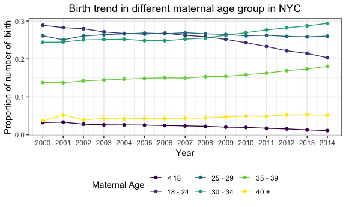
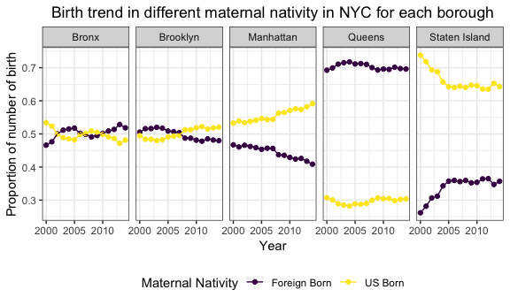
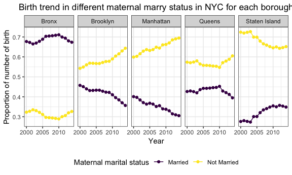
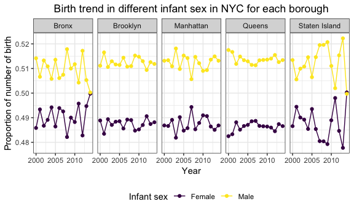
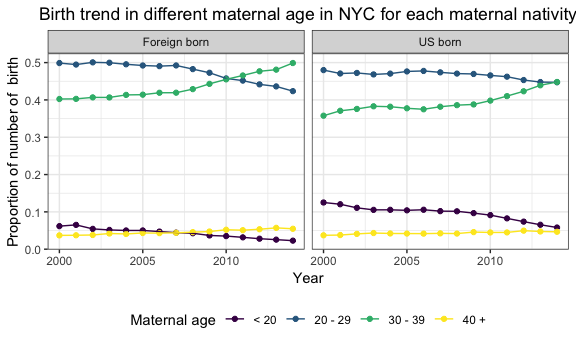

Birth\_data\_report
================
Xue Yang
12/3/2018

This will detail how you completed your project, and should cover data collection and cleaning, exploratory analyses, alternative strategies, descriptions of approaches, and a discussion of results.

• Motivation: Provide an overview of the project goals and motivation. • Related work: Anything that inspired you, such as a paper, a web site, or something we discussed in class. • Initial questions: What questions are you trying to answer? How did these questions evolve over the course of the project? What new questions did you consider in the course of your analysis? • Data: Source, scraping method, cleaning, etc. • Exploratory analysis: Visualizations, summaries, and exploratory statistical analyses. Justify the steps you took, and show any major changes to your ideas. • Additional analysis: If you undertake formal statistical analyses, describe these in detail • Discussion: What were your findings? Are they what you expect? What insights into the data can you make?

Understanding the pattern of birth and death is of critical importance in identifying public health issue. In this study, we are interested in the cause of deaths and birth rate in New York City.

We analysis the birth and death part respectively, and this is for the birth part.

1.Motivation
------------

Provide an overview of the project goals and motivation.

The pattern of birth is very important in the public health issue. The birth rate will directly influence the total population which may have effect on the calculation of the measures of disease occurrence. At the same time, birth rate may also be influenced by the maternal issue, such as maternal age, nativity and so on. So analysing on the birth data can help us identify the issue that may cause the increase or decrease of the birth counts, which can further help us to identify the construction of the total population.

Meanwhile, analysis the birth data can help us identify the demographic characteristics. We can identify the proportion of the infant sex in the birth population, the maternal age, maternal marital status and so on.

Moreover, we are also interested in explore if there are some relationship between different variables that may be associated with the birth data. Such as the infant birthweight and maternal age, maternal nativity and maternal age.

We aim to analysis the following issues in the city of New York by boroughs from year 2000 to 2014. By comparing the trend of specific birth related variables gourped by borough, we can identidy some interesting trend related to public health issue.

For the birth data, we would like to know the birth rate in New York by race, place of origin and borough and we would also plot the time trend of birth rate over the last ten years. Birth defect is also one of our interests. By exploring the dataset, we'd like to know whether a certain kind of birth defect is linked with certain maternal characteristics.

2.Related work
--------------

Anything that inspired you, such as a paper, a web site, or something we discussed in class.

There is a website:<https://www1.nyc.gov/site/doh/about/about-doh.page> which contains a lot of stuffs about health issues in the city of New York. This is from New York City Department of Health and Mental Hygiene, which is one of the largest public health agencies in the world. Their work is really broad-ranging to protect and promote the health of 8 million diverse New Yorkers every day.

From these website, we successful got the data we want about the death and birth in the city of New York for free. At the same time, we read the relative summary from this website to got a guide for our project.

Moreover, from the computing club, we were introducted to create maps in ggplot, which is really cool. Combining with what we have learned about visualization and exploratory analysis in class, we are inspired to create some well-looled plot about the birth and death related stuff in the city of New York.

3.Initial questions
-------------------

What questions are you trying to answer? How did these questions evolve over the course of the project? What new questions did you consider in the course of your analysis?

The main questions we are trying to answer is:

-   How the birth number changes over the time from 2000 to 2014?

-   What the association between maternal and birth characteristics?

When we begin our data manipulation, we found out that there are no individual datas in the website, the data are aggregated in three different ways: community district, zip code and census tract.

So our new question is:

-   Which aggregated data do we decide to use?

Meanwhile, since all the data are aggregated, we can compare the related birth characteristics between the community district, zip code or census tract:

-   Is there any difference of the birth characteristics between different boroughs in the cith of New York?

Moreover, the real data always contain a lot of missing value, so we have another question:

-   How to deal with the missing value rationally?

4.Data
------

Source, scraping method, cleaning, etc.

Our data is from the NYC Department of Health and Mental Hygiene.

Datasets that will be used in this project are, but not limited to, the birth micro SAS Datasets \[Year(s)\] from National Vital Statistics System (time period is from 2000 to 2014). American Community Survey can be refered to for poverty data.

Comparing with the three different aggregated dataset: Community District micro-datasets (single year aggregate counts), Zip Code micro-datasets (aggregated 3 year counts) and Census Tract datasets (aggregated 5 year counts), we choose to use Community District micro-datasets (single year aggregate counts), since this dataset only aggregate for single years, and we can better analysis the trend of birth characteristics by years.

### 4.1 Load and clean the data from community\_district source

``` r
# load and import community_district dataset
birth_data = 
  tibble(file_name = list.files(path = "./data/birth_data/community_district")) %>% 
  mutate(output = purrr::map(str_c("./data/birth_data/community_district/", file_name), haven::read_sas)) %>%
  unnest() %>% 
  separate(file_name, c("name", "year", "del"), sep = c(6, 8)) %>% 
  select(-name, -del) %>%
  mutate(year = str_c("20", year), year = as.numeric(year))


# import cd code dataset
cd_code_data = 
  read_csv("./data/New_York_City_Population_By_Community_Districts 16.09.03.csv") %>%
  janitor::clean_names() %>%
  select(borough, cd_number, cd_name) %>% 
  rename(cd = cd_number) %>% 
  mutate(cd = ifelse(borough == "Bronx", cd + 200, cd)) %>% 
  mutate(cd = ifelse(borough == "Brooklyn", cd + 300, cd)) %>% 
  mutate(cd = ifelse(borough == "Manhattan", cd + 100, cd)) %>% 
  mutate(cd = ifelse(borough == "Queens", cd + 400, cd)) %>% 
  mutate(cd = ifelse(borough == "Staten Island", cd + 500, cd)) 
```

    ## Parsed with column specification:
    ## cols(
    ##   Borough = col_character(),
    ##   `CD Number` = col_integer(),
    ##   `CD Name` = col_character(),
    ##   `1970 Population` = col_integer(),
    ##   `1980 Population` = col_integer(),
    ##   `1990 Population` = col_integer(),
    ##   `2000 Population` = col_integer(),
    ##   `2010 Population` = col_integer()
    ## )

``` r
# join two dataset
birth_data_un = 
  birth_data %>% 
  unnest() %>% 
  left_join(cd_code_data, by = "cd") 
```

The community\_district dataset contains 885 rows x 364 columns, which means that there are 885 birth related observations from year 2000 to 2014 in different community\_district in the city of New York. For the columns, each column indicates a category in a specific birth characteristics, and there are individual variables and crossed variales.

Since the dataset is really large, we decide to analysis the data with each vairables (containing with several categories) respectively.

### 4.2 Deal with missing value

After loading and cleaning the dataset, we find out that there are a lot of missing values in the dataset. We first checking the number and proportion of the missing values in each column

``` r
# check for the number and proprotion of missing value
missing_value = 
  birth_data_un %>% 
  summarise_all(funs(sum(is.na(.)))) %>% 
  gather(term, num_na, everything()) %>% 
  mutate(percent = num_na/885) 
```

Each column in this dataset means a category in a specific birth related variables. If the proprotion of missing values in a column is relatively high, it will make confusion in our analysis. If almost very colums in a specific birth related variable are highly missing , we decide to delete this varibales from the dataset, since it's hard to explore something useful.

Accoring to the missing value proportion and our interests, using the cutoff = 20%, we finally select

-   Individual variables: maternal age, maternal nativity, maternal marital status, infant sex;

-   Crossed variables: maternal nativity and maternal age

for our futher analysis.

5. Exploratory analysis
-----------------------

Visualizations, summaries, and exploratory statistical analyses. Justify the steps you took, and show any major changes to your ideas.

### 5.1 Fill the missing value and tidy separately

As we indicated above, we select the variables according to the missing value proportion and interest. For the variables we selected, we also need to deal with the missing value.

We first calculate the "delta" and "percent", which indicating the differences and proportion between the total number and the sum of non missing value. If the "delta" is relatively small, this means that the missing value only contains a little information, which would not influence the further analysis.

In this case, we fill the missing value with the same data from last year in the same community district, if there are NAs for continuous three year, we fill the NA with 0.

#### 5.1.1 Individual Variables

**Maternal age**

``` r
# data maternal age

birth_data_un %>% 
  select(year, cd, birthtot, age1tot:age9tot) %>%
  gather(maternal_age, num, age1tot:age9tot) %>% 
  group_by(year, cd, birthtot) %>% 
  summarise(ttl = sum(num, na.rm = TRUE)) %>% 
  mutate(delta = birthtot - ttl, percent = delta/birthtot) %>% 
  arrange(desc(delta))
```

    ## # A tibble: 885 x 6
    ## # Groups:   year, cd [885]
    ##     year    cd birthtot   ttl delta percent
    ##    <dbl> <dbl>    <dbl> <dbl> <dbl>   <dbl>
    ##  1  2003   102      842   833     9 0.0107 
    ##  2  2012   105      579   570     9 0.0155 
    ##  3  2000   103     2320  2312     8 0.00345
    ##  4  2000   401     2533  2525     8 0.00316
    ##  5  2002   316     1446  1438     8 0.00553
    ##  6  2002   411      675   667     8 0.0119 
    ##  7  2002   501     2447  2439     8 0.00327
    ##  8  2003   209     2694  2686     8 0.00297
    ##  9  2005   112     2892  2884     8 0.00277
    ## 10  2005   313     1171  1163     8 0.00683
    ## # ... with 875 more rows

``` r
maternal_age_plot_data =
  birth_data_un %>%
  select(year, cd, cd_name, borough, birthtot, age1tot:age9tot) %>%
  gather(maternal_age, num, age1tot:age9tot) %>%
  arrange(cd, maternal_age, year) %>% 
  mutate(num = ifelse(is.na(num) & year != 2000, lag(num), num)) %>% 
  mutate(num = ifelse(is.na(num) & year != 2000, lag(num, 2), num)) %>% 
  mutate(num = ifelse(is.na(num), 0, num)) %>% 
  mutate(new_age = case_when(
    maternal_age %in% c("age1tot", "age2tot") ~ "< 18",
    maternal_age %in% c("age3tot", "age4tot") ~ "18 - 24",
    maternal_age == "age5tot" ~ "25 - 29",
    maternal_age == "age6tot" ~ "30 - 34",
    maternal_age == "age7tot" ~ "35 - 39",
    TRUE                      ~  "40 +"
  )) %>% 
  group_by(year, borough, new_age) %>% 
  summarise(number = sum(num)) 
```

For the data for maternal age, the largest "delta" is 9, with percent 0.0107, we can fill the NA as we indicated above, and then tidy the new non-missing data.

Moreover, the original maternal age data contains nine categories, since the smaller age category contains only a little number of birth characteristics, we joint some group together.

**Maternal nativity**

``` r
# data for maternal nativity

birth_data_un %>% 
  select(year, cd, birthtot, nat1tot:nat2tot) %>%
  gather(born_demo, num, nat1tot:nat2tot) %>% 
  group_by(year, cd, birthtot) %>% 
  summarise(ttl = sum(num, na.rm = TRUE)) %>% 
  mutate(delta = birthtot - ttl, percent = delta/birthtot) %>% 
  arrange(desc(percent))
```

    ## # A tibble: 885 x 6
    ## # Groups:   year, cd [885]
    ##     year    cd birthtot   ttl delta percent
    ##    <dbl> <dbl>    <dbl> <dbl> <dbl>   <dbl>
    ##  1  2003   212     1919  1875    44  0.0229
    ##  2  2002   104      818   800    18  0.0220
    ##  3  2001   212     1964  1921    43  0.0219
    ##  4  2000   103     2320  2275    45  0.0194
    ##  5  2003   110     1669  1638    31  0.0186
    ##  6  2005   203     1293  1271    22  0.0170
    ##  7  2004   105      481   473     8  0.0166
    ##  8  2002   103     2167  2131    36  0.0166
    ##  9  2002   202      912   897    15  0.0164
    ## 10  2006   203     1353  1331    22  0.0163
    ## # ... with 875 more rows

``` r
ma_nat_plot_data =
  birth_data_un %>% 
  select(year, cd, cd_name, borough, birthtot, nat1tot:nat2tot) %>%
  gather(ma_nat, num, nat1tot:nat2tot) %>%
  arrange(cd, ma_nat, year) %>% 
  mutate(num = ifelse(is.na(num) & year != 2000, lag(num), num)) %>% 
  mutate(num = ifelse(is.na(num) & year != 2000, lag(num, 2), num)) %>% 
  mutate(num = ifelse(is.na(num), 0, num)) %>% 
  mutate(new_ma_nat = ifelse(ma_nat == "nat1tot", "US Born", "Foreign Born")) %>% 
  group_by(year, borough, new_ma_nat) %>% 
  summarise(number = sum(num))
```

For the data for maternal nativity, the largest "delta" is 44, with percent 0.0229, we can fill the NA as we indicated above, and then tidy the new non-missing data.

**Maternal marital status **

``` r
# data for maternal marital status 

birth_data_un %>% 
  select(year, cd, birthtot, mar1tot:mar2tot) %>%
  gather(marry_status, num, mar1tot:mar2tot) %>% 
  group_by(year, cd, birthtot) %>% 
  summarise(ttl = sum(num, na.rm = TRUE)) %>% 
  mutate(delta = birthtot - ttl, percent = delta/birthtot) %>% 
  arrange(desc(percent))
```

    ## # A tibble: 885 x 6
    ## # Groups:   year, cd [885]
    ##     year    cd birthtot   ttl delta  percent
    ##    <dbl> <dbl>    <dbl> <dbl> <dbl>    <dbl>
    ##  1  2002   205     2596  2595     1 0.000385
    ##  2  2000   101      436   436     0 0       
    ##  3  2000   102      745   745     0 0       
    ##  4  2000   103     2320  2320     0 0       
    ##  5  2000   104      777   777     0 0       
    ##  6  2000   105      436   436     0 0       
    ##  7  2000   106     1259  1259     0 0       
    ##  8  2000   107     2568  2568     0 0       
    ##  9  2000   108     2734  2734     0 0       
    ## 10  2000   109     1584  1584     0 0       
    ## # ... with 875 more rows

``` r
marry_plot_data =
  birth_data_un %>% 
  select(year, cd, cd_name, borough, birthtot, mar1tot:mar2tot) %>%
  gather(marry_status, num, mar1tot:mar2tot) %>%
  arrange(cd, marry_status, year) %>% 
  mutate(num = ifelse(is.na(num) & year != 2000, lag(num), num)) %>% 
  mutate(num = ifelse(is.na(num) & year != 2000, lag(num, 2), num)) %>% 
  mutate(num = ifelse(is.na(num), 0, num)) %>% 
  mutate(new_marry_status = ifelse(marry_status == "mar1tot", "Married", "Not Married")) %>% 
  group_by(year, borough, new_marry_status) %>% 
  summarise(number = sum(num))  
```

For the data for parity, the largest "delta" is 1, with percent 0.000385, we can fill the NA as we indicated above, and then tidy the new non-missing data.

**Infant sex**

``` r
# data for infant sex
birth_data_un %>% 
  select(year, cd, birthtot, sex1tot:sex2tot) %>%
  gather(infant_sex, num, sex1tot:sex2tot) %>% 
  group_by(year, cd, birthtot) %>% 
  summarise(ttl = sum(num, na.rm = TRUE)) %>% 
  mutate(delta = birthtot - ttl, percent = delta/birthtot) %>% 
  arrange(desc(percent))
```

    ## # A tibble: 885 x 6
    ## # Groups:   year, cd [885]
    ##     year    cd birthtot   ttl delta percent
    ##    <dbl> <dbl>    <dbl> <dbl> <dbl>   <dbl>
    ##  1  2000   101      436   436     0       0
    ##  2  2000   102      745   745     0       0
    ##  3  2000   103     2320  2320     0       0
    ##  4  2000   104      777   777     0       0
    ##  5  2000   105      436   436     0       0
    ##  6  2000   106     1259  1259     0       0
    ##  7  2000   107     2568  2568     0       0
    ##  8  2000   108     2734  2734     0       0
    ##  9  2000   109     1584  1584     0       0
    ## 10  2000   110     1785  1785     0       0
    ## # ... with 875 more rows

``` r
infant_sex_plot_data =
  birth_data_un %>% 
  select(year, cd, cd_name, borough, birthtot, sex1tot:sex2tot) %>%
  gather(infant_sex, num, sex1tot:sex2tot) %>%
  arrange(cd, infant_sex, year) %>% 
  mutate(num = ifelse(is.na(num) & year != 2000, lag(num), num)) %>% 
  mutate(num = ifelse(is.na(num) & year != 2000, lag(num, 2), num)) %>% 
  mutate(num = ifelse(is.na(num), 0, num)) %>% 
  mutate(new_infant_sex = ifelse(infant_sex == "sex1tot", "Male", "Female")) %>% 
  group_by(year, borough, new_infant_sex) %>% 
  summarise(number = sum(num))  
```

For the infant sex data, there is no missing value, which is perfect!

#### 5.1.2 Crossed Variables

**Maternal nativity and Maternal age**

``` r
# data for maternal nativity * maternal age
birth_data_un %>% 
  select(year, cd, birthtot, nat1tot_a1, nat2tot_a1, nat1tot_a2, nat2tot_a2, nat1tot_a3, nat2tot_a3, nat1tot_a4, nat2tot_a4) %>%
  gather(nativity_age, num, nat1tot_a1:nat2tot_a4) %>% 
  group_by(year, cd, birthtot) %>% 
  summarise(ttl = sum(num, na.rm = TRUE)) %>% 
  mutate(delta = birthtot - ttl, percent = delta/birthtot) %>% 
  arrange(desc(percent))
```

    ## # A tibble: 885 x 6
    ## # Groups:   year, cd [885]
    ##     year    cd birthtot   ttl delta percent
    ##    <dbl> <dbl>    <dbl> <dbl> <dbl>   <dbl>
    ##  1  2003   102      842   821    21  0.0249
    ##  2  2003   212     1919  1875    44  0.0229
    ##  3  2002   104      818   800    18  0.0220
    ##  4  2001   212     1964  1921    43  0.0219
    ##  5  2000   103     2320  2275    45  0.0194
    ##  6  2004   105      481   472     9  0.0187
    ##  7  2003   110     1669  1638    31  0.0186
    ##  8  2002   101      389   382     7  0.0180
    ##  9  2004   101      616   605    11  0.0179
    ## 10  2005   203     1293  1271    22  0.0170
    ## # ... with 875 more rows

``` r
birth_nat_age_plot_data =
  birth_data_un %>% 
  select(year, cd, cd_name, borough, birthtot, nat1tot_a1, nat2tot_a1, nat1tot_a2, nat2tot_a2, nat1tot_a3, nat2tot_a3, nat1tot_a4, nat2tot_a4) %>%
  gather(nativity_age, num, nat1tot_a1:nat2tot_a4) %>%
  arrange(cd, nativity_age, year) %>% 
  mutate(num = ifelse(is.na(num) & year != 2000, lag(num), num)) %>% 
  mutate(num = ifelse(is.na(num) & year != 2000, lag(num, 2), num)) %>% 
  mutate(num = ifelse(is.na(num), 0, num)) %>% 
  separate(nativity_age, c("nat", "age"), sep = "tot_") %>%
  mutate(new_nat = ifelse(nat == "nat1", "US born", "Foreign born"),
         new_age = case_when(
    age == "a1" ~ "< 20",
    age == "a2" ~ "20 - 29",
    age == "a3" ~ "30 - 39",
    TRUE                      ~  "40 +"
  )) %>% 
  group_by(year, borough, new_age, new_nat) %>% 
  summarise(number = sum(num))
```

For the data for infant sex and maternal nativity, the largest "delta" is 21, with percent 0.0249, we can fill the NA as we indicated above, and then tidy the new non-missing data.

### 5.2 Visualization

#### 5.2.1 Individual Variables

**Maternal Age**

``` r
# the birth trend in different maternal age in NYC
maternal_age_plot_data %>%
  group_by(year, new_age) %>% 
  summarise(number = sum(number)) %>% 
  mutate(percent = number/ sum(number)) %>% 
  ggplot(aes(x = year, y = percent, color = new_age)) +
  geom_point() +
  geom_line() +
  labs(title = "Birth trend in different maternal age group in NYC",
      y = "Proportion of number of  birth",
      x = "Year",
      color = "Maternal Age") +
  theme_bw() +
  scale_x_continuous(breaks=seq(2000, 2014, 1)) +
  viridis::scale_color_viridis(discrete = TRUE) +
  theme(legend.position = "bottom", plot.title = element_text(hjust = 0.5))
```



We can see that mothers seldom give birth when they are younger than 18. As time went by, the proportion of birth accounted by 30 - 39 maternal age group increased , while the proportion of birth accounted by 18 - 24 decreased. Mothers tend to give birth at a relatively older age. But when they reach 40 years old, the frequency of giving birth dropped.

**Maternal Nativity**

``` r
# the birth trend in different maternal nativity in NYC for each boro
ma_nat_plot_data %>%
  group_by(year, borough) %>% 
  mutate(percent = number/sum(number)) %>% 
  ggplot(aes(x = year, y = percent, color = new_ma_nat)) +
  geom_point() +
  geom_line() +
  facet_grid( ~ borough) +
  labs(title = "Birth trend in different maternal nativity in NYC for each borough",
      y = "Proportion of number of birth",
      x = "Year",
      color = "Maternal Nativity") +
  theme_bw() +
  scale_x_continuous(breaks=seq(2000, 2014, 5)) +
  viridis::scale_color_viridis(discrete = TRUE) +
  theme(legend.position = "bottom", plot.title = element_text(hjust = 0.5))
```



According to the plot above, mothers in Bronx and Brooklyn have the same chance to be Foreign born or US Born. In Queens, about 70% mothers are Foreign born. Opposite from that, in Staten Island, only about 35% mothers are Foreign born. This may be because Queens has the largest proportion of immigrants in New York City.

**Maternal Marital Status**

``` r
#the birth trend in different marry status in NYC for each boro
marry_plot_data %>%
  group_by(year, borough) %>% 
  mutate(percent = number/sum(number)) %>% 
  ggplot(aes(x = year, y = percent, color = new_marry_status)) +
  geom_line() +
  geom_point() +
  facet_grid( ~ borough) +
  labs(title = "Birth trend in different maternal marry status in NYC for each borough",
      y = "Proportion of number of birth",
      x = "Year",
      color = "Maternal marital status") +
  theme_bw() +
  scale_x_continuous(breaks=seq(2000, 2014, 5)) +
  viridis::scale_color_viridis(discrete = TRUE) +
  theme(legend.position = "bottom", plot.title = element_text(hjust = 0.5))
```



The proportion of birth when maternal marital status is not married is always higher than that when status is married in all borough, except for Bronx.In Manhattan and Brooklyn the proportion of birth accounted by not-married mothers increased through 2000 to 2014.

**Infant Sex**

``` r
# the birth trend in different sex in NYC for each boro
infant_sex_plot_data %>%
  group_by(year, borough) %>% 
  mutate(percent = number/sum(number)) %>% 
  ggplot(aes(x = year, y = percent, color = new_infant_sex)) +
  geom_line() +
  geom_point() +
  facet_grid( ~ borough) +
  labs(title = "Birth trend in different infant sex in NYC for each borough",
      y = "Proportion of number of birth",
      x = "Year",
      color = "Infant sex") +
  theme_bw() +
  scale_x_continuous(breaks=seq(2000, 2014, 5)) +
  viridis::scale_color_viridis(discrete = TRUE) +
  theme(legend.position = "bottom", plot.title = element_text(hjust = 0.5))
```



In each borough, the proportion of male infant and the proportion of female infant are very close to each other, flunctuating around 0.51 and 0.49. Surprisingly, we found that the proportion of male infant is always slightly larger than that of female infant.

#### 5.2.2 Crossed Variables

**Maternal Nativity × Maternal Age**

``` r
birth_nat_age_plot_data =
  birth_data_un %>% 
  select(year, cd, cd_name, borough, birthtot, nat1tot_a1, nat2tot_a1, nat1tot_a2, nat2tot_a2, nat1tot_a3, nat2tot_a3, nat1tot_a4, nat2tot_a4) %>%
  gather(nativity_age, num, nat1tot_a1:nat2tot_a4) %>%
  arrange(cd, nativity_age, year) %>% 
  mutate(num = ifelse(is.na(num) & year != 2000, lag(num), num)) %>% 
  mutate(num = ifelse(is.na(num) & year != 2000, lag(num, 2), num)) %>% 
  mutate(num = ifelse(is.na(num), 0, num)) %>% 
  separate(nativity_age, c("nat", "age"), sep = "tot_") %>%
  mutate(new_nat = ifelse(nat == "nat1", "US born", "Foreign born"),
         new_age = case_when(
    age == "a1" ~ "< 20",
    age == "a2" ~ "20 - 29",
    age == "a3" ~ "30 - 39",
    TRUE                      ~  "40 +"
  )) %>% 
  group_by(year, borough, new_age, new_nat) %>% 
  summarise(number = sum(num))

birth_nat_age_plot_data %>% 
  group_by(year, new_nat, new_age) %>% 
  summarise(number = sum(number)) %>%
  group_by(year, new_nat) %>% 
  mutate(percent = number/sum(number)) %>% 
  ggplot(aes(x = year, y = percent, color = new_age)) +
  geom_point() +
  geom_line() +
  facet_grid( ~ new_nat) + 
  labs(title = "Birth trend in different maternal age in NYC for each maternal nativity",
      y = "Proportion of number of  birth",
      x = "Year",
      color = "Maternal age") +
  theme_bw() +
  scale_x_continuous(breaks=seq(2000, 2014, 5)) +
  viridis::scale_color_viridis(discrete = TRUE) +
  theme(legend.position = "bottom", plot.title = element_text(hjust = 0.5))
```



Globally, mothers who are foreign born are younger than those who are US born. The proportions of birth in 20- and 40+ age group are similar between two maternal nativity group. However, The proportion of birth in 20-29 and 30-39 age group in Foreign born is larger than that in US born group.
