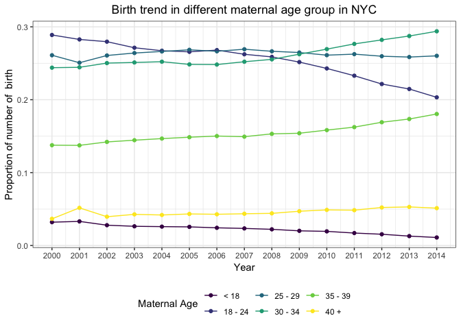
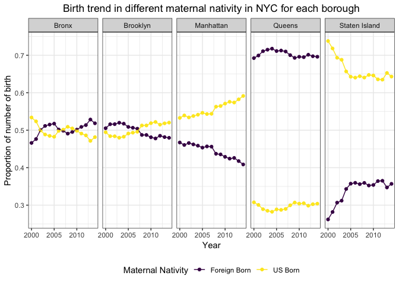
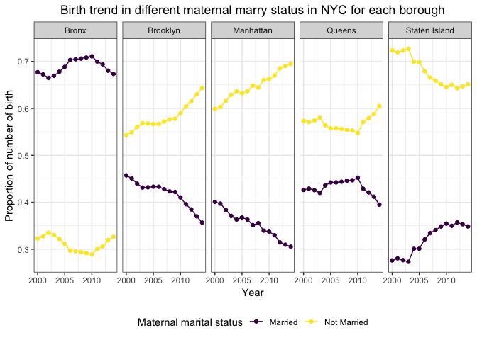
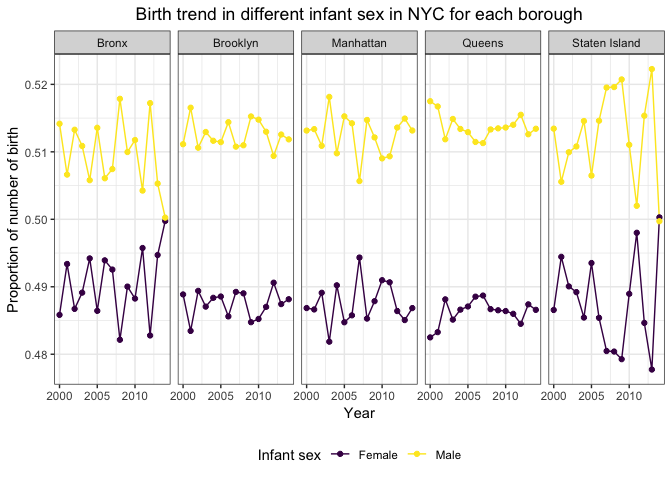
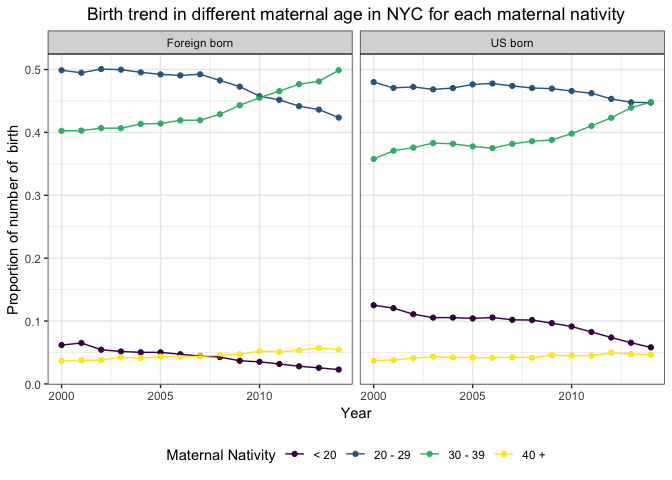

Birth\_plot\_kz2334
================
Kangkang Zhang
12/5/2018

Three different source of the data: community district, zip code and census tract

``` r
# community district
file_name = tibble(
  id = list.files("./birth_data/community_district")
)

birth_data = file_name %>%
  mutate(infor = map(str_c("./birth_data/community_district/", id), read_sas)) %>% 
  separate(id, c("name", "year", "del"), sep = c(6, 8)) %>% 
  select(-name, -del) %>% 
  mutate(year = str_c("20", year), year = as.numeric(year))

# import cd code data
cd_code_data = 
  read_csv("./data/New_York_City_Population_By_Community_Districts 16.09.03.csv") %>%
  janitor::clean_names() %>%
  select(borough, cd_number, cd_name) %>% 
  rename(cd = cd_number) %>% 
  mutate(cd = ifelse(borough == "Bronx", cd + 200, cd)) %>% 
  mutate(cd = ifelse(borough == "Brooklyn", cd + 300, cd)) %>% 
  mutate(cd = ifelse(borough == "Manhattan", cd + 100, cd)) %>% 
  mutate(cd = ifelse(borough == "Queens", cd + 400, cd)) %>% 
  mutate(cd = ifelse(borough == "Staten Island", cd + 500, cd)) 
```

    ## Parsed with column specification:
    ## cols(
    ##   Borough = col_character(),
    ##   `CD Number` = col_integer(),
    ##   `CD Name` = col_character(),
    ##   `1970 Population` = col_integer(),
    ##   `1980 Population` = col_integer(),
    ##   `1990 Population` = col_integer(),
    ##   `2000 Population` = col_integer(),
    ##   `2010 Population` = col_integer()
    ## )

``` r
# join two data
birth_data_un = 
  birth_data %>% 
  unnest() %>% 
  left_join(cd_code_data, by = "cd") 
```

### Visualization

**Maternal Age**

``` r
maternal_age_plot_data =
  birth_data_un %>%
  select(year, cd, cd_name, borough, birthtot, age1tot:age9tot) %>%
  gather(maternal_age, num, age1tot:age9tot) %>%
  arrange(cd, maternal_age, year) %>% 
  mutate(num = ifelse(is.na(num) & year != 2000, lag(num), num)) %>% 
  mutate(num = ifelse(is.na(num) & year != 2000, lag(num, 2), num)) %>% 
  mutate(num = ifelse(is.na(num), 0, num)) %>% 
  mutate(new_age = case_when(
    maternal_age %in% c("age1tot", "age2tot") ~ "< 18",
    maternal_age %in% c("age3tot", "age4tot") ~ "18 - 24",
    maternal_age == "age5tot" ~ "25 - 29",
    maternal_age == "age6tot" ~ "30 - 34",
    maternal_age == "age7tot" ~ "35 - 39",
    TRUE                      ~  "40 +"
  )) %>% 
  group_by(year, borough, new_age) %>% 
  summarise(number = sum(num)) 
  
#the birth trend in different maternal age in NYC
maternal_age_plot_data %>%
  group_by(year, new_age) %>% 
  summarise(number = sum(number)) %>% 
  mutate(percent = number/ sum(number)) %>% 
  ggplot(aes(x = year, y = percent, color = new_age)) +
  geom_point() +
  geom_line() +
  labs(title = "Birth trend in different maternal age group in NYC",
      y = "Proportion of number of  birth",
      x = "Year",
      color = "Maternal Age") +
  theme_bw() +
  scale_x_continuous(breaks=seq(2000, 2014, 1)) +
  viridis::scale_color_viridis(discrete = TRUE) +
  theme(legend.position = "bottom", plot.title = element_text(hjust = 0.5))
```



We can see that mothers seldom give birth when they are younger than 18. As time went by, the proportion of birth accounted by 30 - 39 maternal age group increased , while the proportion of birth accounted by 18 - 24 decreased. Mothers tend to give birth at a relatively older age. But when they reach 40 years old, the frequency of giving birth dropped.

**Maternal Nativity**

``` r
ma_nat_plot_data =
  birth_data_un %>% 
  select(year, cd, cd_name, borough, birthtot, nat1tot:nat2tot) %>%
  gather(ma_nat, num, nat1tot:nat2tot) %>%
  arrange(cd, ma_nat, year) %>% 
  mutate(num = ifelse(is.na(num) & year != 2000, lag(num), num)) %>% 
  mutate(num = ifelse(is.na(num) & year != 2000, lag(num, 2), num)) %>% 
  mutate(num = ifelse(is.na(num), 0, num)) %>% 
  mutate(new_ma_nat = ifelse(ma_nat == "nat1tot", "US Born", "Foreign Born")) %>% 
  group_by(year, borough, new_ma_nat) %>% 
  summarise(number = sum(num))

#the birth trend in different maternal nativity in NYC for each boro
ma_nat_plot_data %>%
  group_by(year, borough) %>% 
  mutate(percent = number/sum(number)) %>% 
  ggplot(aes(x = year, y = percent, color = new_ma_nat)) +
  geom_point() +
  geom_line() +
  facet_grid( ~ borough) +
  labs(title = "Birth trend in different maternal nativity in NYC for each borough",
      y = "Proportion of number of birth",
      x = "Year",
      color = "Maternal Nativity") +
  theme_bw() +
  scale_x_continuous(breaks=seq(2000, 2014, 5)) +
  viridis::scale_color_viridis(discrete = TRUE) +
  theme(legend.position = "bottom", plot.title = element_text(hjust = 0.5))
```



According to the plot above, mothers in Bronx and Brooklyn have the same chance to be Foreign born or US Born. In Queens, about 70% mothers are Foreign born. Opposite from that, in Staten Island, only about 35% mothers are Foreign born. This may be because Queens has the largest proportion of immigrants in New York City.

**Maternal Marital Status**

``` r
# data for maternal marital status 
marry_plot_data =
  birth_data_un %>% 
  select(year, cd, cd_name, borough, birthtot, mar1tot:mar2tot) %>%
  gather(marry_status, num, mar1tot:mar2tot) %>%
  arrange(cd, marry_status, year) %>% 
  mutate(num = ifelse(is.na(num) & year != 2000, lag(num), num)) %>% 
  mutate(num = ifelse(is.na(num) & year != 2000, lag(num, 2), num)) %>% 
  mutate(num = ifelse(is.na(num), 0, num)) %>% 
  mutate(new_marry_status = ifelse(marry_status == "mar1tot", "Married", "Not Married")) %>% 
  group_by(year, borough, new_marry_status) %>% 
  summarise(number = sum(num))  

#the birth trend in different marry status in NYC for each boro
marry_plot_data %>%
  group_by(year, borough) %>% 
  mutate(percent = number/sum(number)) %>% 
  ggplot(aes(x = year, y = percent, color = new_marry_status)) +
  geom_line() +
  geom_point() +
  facet_grid( ~ borough) +
  labs(title = "Birth trend in different maternal marry status in NYC for each borough",
      y = "Proportion of number of birth",
      x = "Year",
      color = "Maternal marital status") +
  theme_bw() +
  scale_x_continuous(breaks=seq(2000, 2014, 5)) +
  viridis::scale_color_viridis(discrete = TRUE) +
  theme(legend.position = "bottom", plot.title = element_text(hjust = 0.5))
```



The proportion of birth when maternal marital status is not married is always higher than that when status is married in all borough, except for Bronx.In Manhattan and Brooklyn the proportion of birth accounted by not-married mothers increased through 2000 to 2014.

**Infant Sex**

``` r
# data for infant sex
infant_sex_plot_data =
  birth_data_un %>% 
  select(year, cd, cd_name, borough, birthtot, sex1tot:sex2tot) %>%
  gather(infant_sex, num, sex1tot:sex2tot) %>%
  arrange(cd, infant_sex, year) %>% 
  mutate(num = ifelse(is.na(num) & year != 2000, lag(num), num)) %>% 
  mutate(num = ifelse(is.na(num) & year != 2000, lag(num, 2), num)) %>% 
  mutate(num = ifelse(is.na(num), 0, num)) %>% 
  mutate(new_infant_sex = ifelse(infant_sex == "sex1tot", "Male", "Female")) %>% 
  group_by(year, borough, new_infant_sex) %>% 
  summarise(number = sum(num))  

#the birth trend in different sex in NYC for each boro
infant_sex_plot_data %>%
  group_by(year, borough) %>% 
  mutate(percent = number/sum(number)) %>% 
  ggplot(aes(x = year, y = percent, color = new_infant_sex)) +
  geom_line() +
  geom_point() +
  facet_grid( ~ borough) +
  labs(title = "Birth trend in different infant sex in NYC for each borough",
      y = "Proportion of number of birth",
      x = "Year",
      color = "Infant sex") +
  theme_bw() +
  scale_x_continuous(breaks=seq(2000, 2014, 5)) +
  viridis::scale_color_viridis(discrete = TRUE) +
  theme(legend.position = "bottom", plot.title = element_text(hjust = 0.5))
```



In each borough, the proportion of male infant and the proportion of female infant are very close to each other, flunctuating around 0.51 and 0.49. Surprisingly, we found that the proportion of male infant is always slightly larger than that of female infant.

**Maternal Nativity × Maternal Age**

``` r
birth_nat_age_plot_data =
  birth_data_un %>% 
  select(year, cd, cd_name, borough, birthtot, nat1tot_a1, nat2tot_a1, nat1tot_a2, nat2tot_a2, nat1tot_a3, nat2tot_a3, nat1tot_a4, nat2tot_a4) %>%
  gather(nativity_age, num, nat1tot_a1:nat2tot_a4) %>%
  arrange(cd, nativity_age, year) %>% 
  mutate(num = ifelse(is.na(num) & year != 2000, lag(num), num)) %>% 
  mutate(num = ifelse(is.na(num) & year != 2000, lag(num, 2), num)) %>% 
  mutate(num = ifelse(is.na(num), 0, num)) %>% 
  separate(nativity_age, c("nat", "age"), sep = "tot_") %>%
  mutate(new_nat = ifelse(nat == "nat1", "US born", "Foreign born"),
         new_age = case_when(
    age == "a1" ~ "< 20",
    age == "a2" ~ "20 - 29",
    age == "a3" ~ "30 - 39",
    TRUE                      ~  "40 +"
  )) %>% 
  group_by(year, borough, new_age, new_nat) %>% 
  summarise(number = sum(num))

birth_nat_age_plot_data %>% 
  group_by(year, new_nat, new_age) %>% 
  summarise(number = sum(number)) %>%
  group_by(year, new_nat) %>% 
  mutate(percent = number/sum(number)) %>% 
  ggplot(aes(x = year, y = percent, color = new_age)) +
  geom_point() +
  geom_line() +
  facet_grid( ~ new_nat) + 
  labs(title = "Birth trend in different maternal age in NYC for each maternal nativity",
      y = "Proportion of number of  birth",
      x = "Year",
      color = "Maternal Nativity") +
  theme_bw() +
  scale_x_continuous(breaks=seq(2000, 2014, 5)) +
  viridis::scale_color_viridis(discrete = TRUE) +
  theme(legend.position = "bottom", plot.title = element_text(hjust = 0.5))
```



Globally, mothers who are foreign born are younger than those who are US born. The proportions of birth in 20- and 40+ age group are similar between two maternal nativity group. However, The proportion of birth in 20-29 and 30-39 age group in Foreign born is larger than that in US born group.
