Final\_rep
================
Yi Xiao
05/12/2018

``` r
library(haven)
library(dplyr)
```

    ## 
    ## Attaching package: 'dplyr'

    ## The following objects are masked from 'package:stats':
    ## 
    ##     filter, lag

    ## The following objects are masked from 'package:base':
    ## 
    ##     intersect, setdiff, setequal, union

``` r
library(tidyverse)
```

    ## ── Attaching packages ─────────────────────────────────────────────────────────────────── tidyverse 1.2.1 ──

    ## ✔ ggplot2 3.0.0     ✔ readr   1.1.1
    ## ✔ tibble  1.4.2     ✔ purrr   0.2.5
    ## ✔ tidyr   0.8.1     ✔ stringr 1.3.1
    ## ✔ ggplot2 3.0.0     ✔ forcats 0.3.0

    ## ── Conflicts ────────────────────────────────────────────────────────────────────── tidyverse_conflicts() ──
    ## ✖ dplyr::filter() masks stats::filter()
    ## ✖ dplyr::lag()    masks stats::lag()

``` r
library(stringi)
library(ggplot2)
library(ggmap)
library(rgeos)
```

    ## rgeos version: 0.4-2, (SVN revision 581)
    ##  GEOS runtime version: 3.6.1-CAPI-1.10.1 
    ##  Linking to sp version: 1.3-1 
    ##  Polygon checking: TRUE

``` r
library(maptools)
```

    ## Loading required package: sp

    ## Checking rgeos availability: TRUE

``` r
library(geojsonio)
```

    ## 
    ## Attaching package: 'geojsonio'

    ## The following object is masked from 'package:base':
    ## 
    ##     pretty

``` r
library(viridis)
```

    ## Loading required package: viridisLite

``` r
library(plotly)
```

    ## 
    ## Attaching package: 'plotly'

    ## The following object is masked from 'package:ggmap':
    ## 
    ##     wind

    ## The following object is masked from 'package:ggplot2':
    ## 
    ##     last_plot

    ## The following object is masked from 'package:stats':
    ## 
    ##     filter

    ## The following object is masked from 'package:graphics':
    ## 
    ##     layout

``` r
library(ggpubr)
```

    ## Loading required package: magrittr

    ## 
    ## Attaching package: 'magrittr'

    ## The following object is masked from 'package:ggmap':
    ## 
    ##     inset

    ## The following object is masked from 'package:purrr':
    ## 
    ##     set_names

    ## The following object is masked from 'package:tidyr':
    ## 
    ##     extract

1. load the data
================

``` r
#import death data from 2004 to 2014
name = list.files(path = "./data", full.names = TRUE, pattern = "*.sas7bdat") 
cd_data =  map_df(name, read_sas)  %>%
  janitor::clean_names()
year = as.data.frame(rep(2000:2014, each = 59)) 

# add a column "year"
cd_data = cbind(year, cd_data) 
colnames(cd_data)[1] = "year"

community_district = unique(cd_data$community_district)
cd_number = c(101:112, 201:212, 301: 318, 401:414, 501:503)
community_district = as.tibble(cbind(community_district, cd_number))

cd_data = merge(cd_data, community_district , by = "community_district")


# import population data
cd_number2 = c(201:212, 301: 318, 101:112, 401:414, 501:503)
pop_data2 = read_csv("./data/New_York_City_Population_By_Community_Districts 16.09.03.csv") %>%
 janitor::clean_names() 
```

    ## Parsed with column specification:
    ## cols(
    ##   Borough = col_character(),
    ##   `CD Number` = col_integer(),
    ##   `CD Name` = col_character(),
    ##   `1970 Population` = col_integer(),
    ##   `1980 Population` = col_integer(),
    ##   `1990 Population` = col_integer(),
    ##   `2000 Population` = col_integer(),
    ##   `2010 Population` = col_integer()
    ## )

``` r
pop_data2 = cbind(cd_number2, pop_data2) %>%
  select(borough, cd_number2, cd_name, x2000_population, x2010_population) %>%
  rename("cd_number" = "cd_number2")
  # standardize the cd_number

  


  
# merge the two datasets
my_data = merge(pop_data2, cd_data, by = "cd_number") 
 
my_tidy_data = my_data %>% # we'll use 2000 year population data for 2000 - 2009, and 2010 year data for 2010 -2014 
  mutate(population = ifelse(year < 2010, my_data$x2000_population, my_data$x2010_population)) %>%
  select(-c(x2000_population, x2010_population)) %>% 
  mutate(cd_name = as.factor(cd_name)
         ) %>%
  select(c(cd_number:cd_name, year:population))
```

The generated dataset consists of 885 observations and 1315 columns. Each observation records information on population and death statistics in one of 59 community districts in New York City. Variables in the original dataset include sex, age, ethnicity and cause of death and their cross variable with each other. Since we are interested in cause of death in this project, we only kept cause of death and its cross information with other demographic variables.

Cause of death is denoted with c1 to c22, which represent Deaths due to septicemia, Deaths due to HIV, Deaths due to malignant neoplasms (cancer), Deaths due to cancer of the colon, rectum, and anus, Deaths due to cancer of the pancreas, Deaths due to trachea, bronchus, and lung, Deaths due to cancer of the breast (female), Deaths due to cancer of the prostate, Deaths due to diabetes mellitus, Deaths due to use of or poisoning by psychoactive substance excluding alcohol and tobacco, Deaths due to Alzheimer's disease, Deaths due to diseases of the heart, Deaths due to essential hypertension and hypertensive renal disease, Deaths due to cerebrovascular diseases, Deaths due to influenza and pneumonia, Deaths due to chronic lower respiratory diseases, Deaths due to chronic liver disease and cirrhosis, Deaths due to Nephritis, Nephrotic Syndrome and Nephrosis, Deaths due to accident except drug poisoning, Deaths due to intentional self‐harm (suicide), Deaths due to assault (homicide), respectively.

2. tidy the data
================

### 2.1 dealting with missing value

``` r
missing_value = 
  my_tidy_data %>% 
  summarise_all(funs(sum(is.na(.)))) %>% 
  gather(term, num_na, everything()) %>% 
  mutate(percent = num_na/nrow(my_tidy_data)) %>% 
  filter(percent > 0.2) 
```

We filtered those variables with more than 20% of missing value and found `nrow(missing_value)` fell into this category. However, it is quite reasonable that no people from a certain age or gender group died of a certain disease in a specific year and neighbourhood and thus resulted in absence of recording. Missing data could suggest 0 death and removing them will lead to loss of valuable information. Therefore, we kept those missing value in our dataset.

### 2.2 split the dataset into several subsets

#### dataset without demographic characteristcs

``` r
# we are first dealing with death infomation without accounting for other demographic characteristics
total_death_data = my_tidy_data %>%
  select(cd_number:year, x1: x22, population, total) %>%
  gather(key = "cause_of_death", value = number, x1:x22) 
```

#### dataset crossed with other gender

``` r
# cause of death crossed with gender
gender_death_data = my_tidy_data %>%
   select(cd_number : year, c1male :c22female) %>%
   gather (key = "cause_of_death", value = "number", c1male : c22female)   

# split "death cause/gender" into gender
  gender_death_data = gender_death_data %>% 
   mutate(gender = ifelse(str_detect(gender_death_data$cause_of_death, "female"), "female", "male"))

  #split "death cause/gender" into cause of death
gender_death_data =gender_death_data %>%
 mutate(cause_of_death = 
       substr(gender_death_data$cause_of_death,1,str_locate(gender_death_data$cause_of_death, "[0-9][a-zA-Z]")[,1])
 )  

# aggregate cd-level data into borough-level
gender_death_data2 = gender_death_data %>%
  group_by(borough, year, gender, cause_of_death) %>%
  summarise(number_cs_boro_gdr = sum(number, na.rm = TRUE)) 
```

#### dataset crossed with age

``` r
# cause of death crossed with age 
# gather the age and death info 
age_death_data = my_tidy_data %>% 
select(cd_number: year, c1age_1_12months:c22age_85) %>%
  gather (key = "cause_of_death", value = "number", c1age_1_12months : c22age_85) 

# split the comb variable into age and cause of death
age_death_data = age_death_data %>% 
  mutate(
    age_group = 
      substr(age_death_data$cause_of_death, str_locate(age_death_data$cause_of_death, "age")[,1] + 4, nchar(age_death_data$cause_of_death))
    ) %>%
  mutate(cause_of_death =  
           substr(age_death_data$cause_of_death, 0, (str_locate(age_death_data$cause_of_death, "age")[,1] -1)))  


# aggregate cd-wise number into borough-wise
age_death_data2 = age_death_data %>%
  group_by(borough, year, age_group, cause_of_death) %>%
  summarise(borough_age_death = sum(number, na.rm = TRUE))

# aggregate age groups
age_death_data3 = age_death_data2 %>%
  ungroup %>%
  mutate(age_group = case_when(
    !(age_group  %in% c("1_12months", "28days", "65_69", "70_74", "75_79", "80_84", "85")) ~ "Premature Death",
    age_group %in% c("65_69", "70_74", "75_79", "80_84", "85") ~ ">65 age death",
    age_group == "28days" ~ "new born death",
    age_group == "1_12months" ~ "1_12months death"
  ) )
```

#### dataset crossed with race

``` r
# cause of death crossed with race 
race_death_data = my_tidy_data %>%
   select(cd_number:year, c11:c225) %>%
     gather (key = "cause_of_death", value = "number", c11:c225) 

race_death_data = race_death_data %>%
  mutate(race = stri_sub(race_death_data$cause_of_death, -1)) %>%
  mutate(
    cause_of_death = 
      substr(cause_of_death, start = 1, stop = nchar(race_death_data$cause_of_death)-1)
                  ) 

# aggregate cd-wise number into borough-wise
race_death_data2 = race_death_data %>%
  group_by(borough, year, race, cause_of_death )%>%
  summarise(borough_race_death = sum(number, na.rm = TRUE))
```

#### 2.3 write a function to replace cause of death code to detailed description

``` r
replace_cd = function(df){ 
 
  df$cause_of_death[df$cause_of_death == "x1" | df$cause_of_death == "c1"] = "septicemia" 
  df$cause_of_death[df$cause_of_death == "x2" | df$cause_of_death == "c2"] = "HIV"
  df$cause_of_death[df$cause_of_death == "x3" | df$cause_of_death == "c3"] = "malignant neoplasms (cancer)"
  df$cause_of_death[df$cause_of_death == "x4" | df$cause_of_death == "c4"] = "cancer of the colon, rectum, and anus"
  df$cause_of_death[df$cause_of_death == "x5" | df$cause_of_death == "c5"] = "cancer of the pancreas"
  df$cause_of_death[df$cause_of_death == "x6" | df$cause_of_death == "c6"] = "trachea, bronchus, and lung"
  df$cause_of_death[df$cause_of_death == "x7" | df$cause_of_death == "c7"] = "cancer of the breast (female)"
  df$cause_of_death[df$cause_of_death == "x8" | df$cause_of_death == "c8"] = "cancer of the prostate"
  df$cause_of_death[df$cause_of_death == "x9" | df$cause_of_death == "c9"] = " diabetes mellitus"
  df$cause_of_death[df$cause_of_death == "x10" | df$cause_of_death == "c10"] = "psychoactive substance"
  df$cause_of_death[df$cause_of_death == "x11"  | df$cause_of_death == "c11"] = "Alzheimer's disease"
  df$cause_of_death[df$cause_of_death == "x12" | df$cause_of_death == "c12"] = " diseases of the heart"
  df$cause_of_death[df$cause_of_death == "x13" | df$cause_of_death == "c13"] = "hypertension/hypertensive renal disease"
  df$cause_of_death[df$cause_of_death == "x14" | df$cause_of_death == "c14"] = "cerebrovascular diseases"
  df$cause_of_death[df$cause_of_death == "x15" | df$cause_of_death == "c15"] = "influenza and pneumonia"
  df$cause_of_death[df$cause_of_death == "x16" | df$cause_of_death == "c16"] = "chronic lower respiratory diseases"
  df$cause_of_death[df$cause_of_death == "x17" | df$cause_of_death == "c17"] = "chronic liver disease and cirrhosis"
  df$cause_of_death[df$cause_of_death == "x18" | df$cause_of_death == "c18"] = "Nephritis, Nephrotic Syndrome and Nephrosis"
  df$cause_of_death[df$cause_of_death == "x19" | df$cause_of_death == "c19"] = "accident except drug poisoning"
  df$cause_of_death[df$cause_of_death == "x20" | df$cause_of_death == "c20"] = "intentional self‐harm (suicide)"
  df$cause_of_death[df$cause_of_death == "x21" | df$cause_of_death == "c21"] = "assault (homicide)"
  df$cause_of_death[df$cause_of_death == "x22" | df$cause_of_death == "c22"] = "others"
  df
}

## replace
total_death_data = replace_cd(total_death_data)
gender_death_data2 = replace_cd(gender_death_data2)
race_death_data2 = replace_cd(race_death_data2)
age_death_data2 = replace_cd(age_death_data2)
age_death_data3 = replace_cd(age_death_data3)
```

3. data analysis
================

#### 3.1 crude mortality rate

``` r
# 14-year average crude mortality rate in each community district in New York City
cd_death_rate  = total_death_data %>%
  group_by(borough, cd_name, year) %>%
  summarise(total_cd_death = sum(number, na.rm = TRUE), population = mean(population), cd_number = mean(as.numeric(cd_number))) %>%
  mutate(motality_rate = total_cd_death/population) %>%
  group_by(cd_name, borough) %>%
  summarise(average_death_rate = mean(motality_rate), cd_number = mean(cd_number)) %>%
  arrange(desc(average_death_rate))


cd_death_rate %>%
   ggplot(aes(x = reorder(cd_name,average_death_rate), y = average_death_rate, fill = borough)) +
   geom_bar(stat = "identity") +
   labs(title = "10-year average crude mortality rate in each community district in New York City",
             x = "Community District",
             y = "Average Motality Rate") +
        theme(axis.text.x = element_text(angle=90, vjust=0.6)) +
  viridis::scale_fill_viridis(discrete = TRUE) 
```

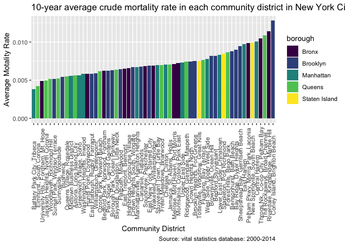 We can see that the mortality rate are higher on average in Bronx and Brooklyn. The boroughs with highest mortality are Coney Island in Brooklyn and Riverdale in Bronx. The areas with more wealthy people like Manhattan and Queens have a relative low mortality rate overall.

``` r
URL <- "http://services5.arcgis.com/GfwWNkhOj9bNBqoJ/arcgis/rest/services/nycd/FeatureServer/0/query?where=1=1&outFields=*&outSR=4326&f=geojson"
fil <- "nyc_community_districts.geojson"
if (!file.exists(fil)) download.file(URL, fil)

nyc_districts = geojson_read(fil, what="sp")


nyc_districts_map = fortify(nyc_districts, region="BoroCD") # add border line 

mids = cbind.data.frame(as.data.frame(gCentroid(nyc_districts, byid=TRUE)), 
                         id=nyc_districts$BoroCD)

ny_map = ggplot() %>% +  # draw NYC map
         geom_map(data=nyc_districts_map, map=nyc_districts_map,
                    aes(x=long, y=lat, map_id=id),
                    color="#2b2b2b", size=0.15, fill=NA) + 
        geom_text(data=mids, aes(x=x, y=y, label=id), size=2) +
        coord_map() + 
        ggthemes::theme_map()
```

    ## Warning: Ignoring unknown aesthetics: x, y

``` r
par(mfrow = c(2,1))
 nyc_districts@data =  merge(nyc_districts@data, cd_death_rate, by.x = "BoroCD", by.y = "cd_number")

choro = data.frame(district=nyc_districts@data$BoroCD,  
                    average_death_rate=nyc_districts@data$average_death_rate)

cd_death_map = nyc_districts_map %>% # add color to map 
ggplot()+
geom_map(map=nyc_districts_map,
                    aes(x=long, y=lat, map_id=id),
                    color="#2b2b2b", size=0.15, fill=NA) +
geom_map(data=choro, map=nyc_districts_map,
                    aes(fill=average_death_rate, map_id=district),
                    color="#2b2b2b", size=0.15) +
scale_fill_viridis(name="Average death rate") + 
coord_map() +
ggthemes::theme_map() +
theme(legend.position=c(0.1,0.5)) +
   labs(title = "average crude mortality rate in each community district in New York City from 2000 to 2014"
            )
```

    ## Warning: Ignoring unknown aesthetics: x, y

``` r
cd_death_map
```

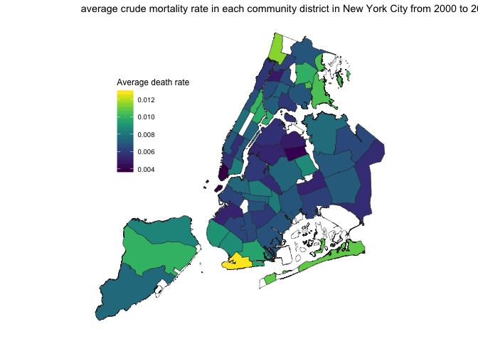

Geographically speaking, the map shows a very interesting pattern that the far north and the far south part of New York are having the highest mortality rates. The middle part of New York is having a lower mortality rate. But this can also be confounded by the income level of the people living in those areas. Because the people live in the middle part usually have a higher income, they can afford the housing in the central area which are more expensive than the surrounding area.

``` r
# cause-specific mortality rate in each borough
specific_death_rate = total_death_data %>%
  group_by(borough, year, cause_of_death) %>%
  summarise(cause_specific_death = sum(number, na.rm = TRUE), population = sum(population)) %>% # calculate the population  in each borough and number of people died of each cause 
  mutate(cause_specific_death_rate = cause_specific_death/population) %>% # calculate cause-specific mortality rate
  group_by(borough, cause_of_death) %>% # get average death rate
  summarise(mean_cs_death_rate = mean(cause_specific_death_rate)) %>%
  arrange(borough, mean_cs_death_rate)

specific_death_rate %>%
  ggplot(aes(x = reorder(cause_of_death, mean_cs_death_rate), y = mean_cs_death_rate)) +
  geom_bar(aes(fill = cause_of_death), stat = "identity") +
  facet_grid(. ~ borough)  +
   labs(title = "14-year average cause-specific crude mortality rate in each borough",
             x = "Cause of Death",
             y = "Cause-specific Mortality Rate",
              caption = "Source: vital statistics database: 2004-2014") +
        theme(axis.text.x = element_text(angle=90, size = 8, vjust=0.6)) +
        theme(legend.position="bottom", 
              legend.key.size = unit(.1, "in")) +
    coord_flip()  +
  viridis::scale_fill_viridis(discrete = TRUE)
```

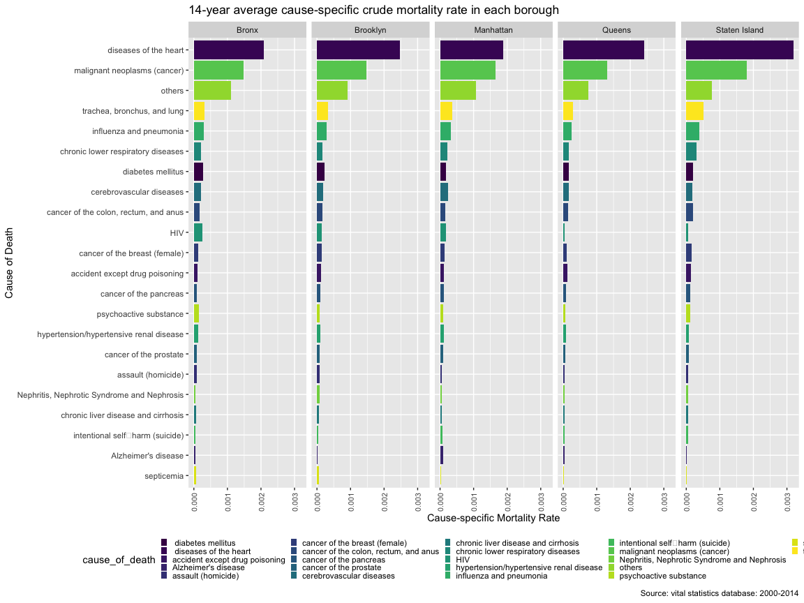

We can now see that the disease of the heart is the leading cause of deaths in all areas. Cancer is the second most common cause of deaths in all areas. Overall, in terms of Cause of Deaths distribution across areas, we do not see a big difference in the structure of the cause of deaths.

``` r
# annual mortality rate in New York City from 2000 to 2010
year_death_rate = total_death_data %>%
  group_by(borough, year) %>%
  summarise(total_borough_death = sum(number, na.rm = TRUE), population = sum(population)/22) %>%
  mutate(motality_rate = total_borough_death/population) 
  

year_death_rate %>%
  ggplot(aes(x = year, y = motality_rate, group = borough, color = borough)) +
  geom_line() + 
  geom_point() +
  labs(x = "Year", 
         y = "Crude motality rate", 
         title = "Crude motality rate in New York City across time") + 
  viridis::scale_color_viridis(discrete = TRUE)
```

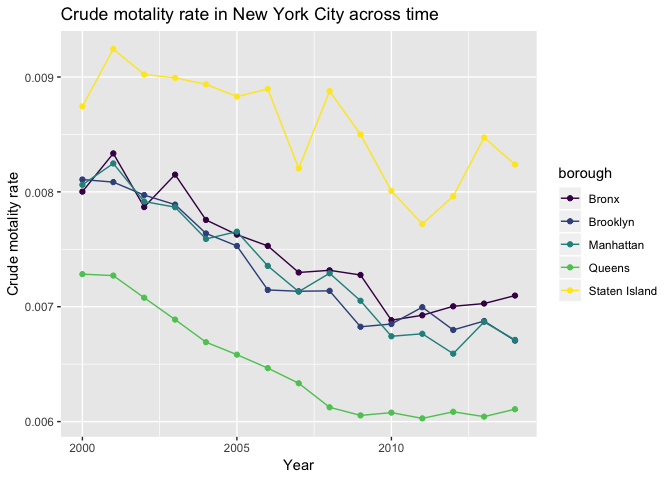 From a longitudinal perspective, the mortality rate goes down as the years go by. The mortality rate for Brooklyn, Manhattan and Bronx are clustered together in terms of years. Staten Island has a higher mortality rate overall and Queens has the lowest mortality rate. There is a drop in mortality rates between 2006 and 2007. In 2010, there is a second drop in mortality rates.

``` r
year_cs_death_ny = total_death_data %>%
  group_by(year, cause_of_death) %>%
  summarise(specific_death_number = sum(number, na.rm = TRUE), total_population = sum(population)) %>%
  mutate(motality_rate = specific_death_number/total_population) %>%
filter(year %in% c("2000", "2006", "2012", "2014")) %>%
  group_by(year) %>%
  top_n(n = 10, wt = motality_rate) 
  
lead_cause = merge(year_cs_death_ny, total_death_data) %>% 
  group_by(year, cause_of_death) %>%
  summarise(specific_death_number = sum(number, na.rm = TRUE), total_population = sum(population)) %>%
  mutate(motality_rate = specific_death_number/total_population)

# identify the top ten death by borough
lead_death3 = merge(lead_cause, total_death_data, by = c("year", "cause_of_death")) %>%
  group_by(borough, year, cause_of_death) %>%
  summarise(br_death_number = sum(number, na.rm = TRUE), br_population = sum(population)) %>%
  mutate(br_rate = br_death_number/br_population)
  
yr00 =   
lead_death3 %>% 

  filter(year == 2000) %>%
  ggplot(aes(reorder(x = cause_of_death, br_rate), y = br_rate, fill = borough)) +
  geom_bar(stat = "identity") + 
  theme_bw() +
   theme(axis.text.x = element_text(angle=90, vjust=0.6)) +
   labs(x = "Cause of death", 
         y = "Crude mortality rate", 
         title = "leading cause of death in 2000") +
  coord_flip()  +
  viridis::scale_fill_viridis(discrete = TRUE) 

yr06 = 
lead_death3 %>% 
filter(year == 2006) %>%
  ggplot(aes(reorder(x = cause_of_death, br_rate), y = br_rate, fill = borough)) +
  geom_bar(stat = "identity") + 
  theme_bw() +
   theme(axis.text.x = element_text(angle=90, vjust=0.6)) +
   labs(x = "Cause of death", 
         y = "Crude mortality rate", 
         title = "leading cause of death in 2006") +
  coord_flip()  +
  viridis::scale_fill_viridis(discrete = TRUE) 

yr12 = 
lead_death3 %>% 
filter(year == 2012) %>%
  ggplot(aes(reorder(x = cause_of_death, br_rate), y = br_rate, fill = borough)) +
  geom_bar(stat = "identity") + 
  theme_bw() +
   theme(axis.text.x = element_text(angle=90, vjust=0.6)) +
   labs(x = "Cause of death", 
         y = "Crude mortality rate", 
         title = "leading cause of death in 2012") +
  coord_flip()  +
  viridis::scale_fill_viridis(discrete = TRUE) 

yr14=
  lead_death3 %>% 
filter(year == 2014) %>%
  ggplot(aes(reorder(x = cause_of_death, br_rate), y = br_rate, fill = borough)) +
  geom_bar(stat = "identity") + 
  theme_bw() +
   theme(axis.text.x = element_text(angle=90, vjust=0.6)) +
   labs(x = "Cause of death", 
         y = "Crude mortality rate", 
         title = "leading cause of death in 2014") +
  coord_flip()  +
  viridis::scale_fill_viridis(discrete = TRUE) 

yr00
```

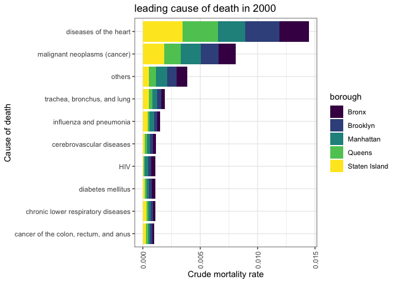

``` r
yr06
```

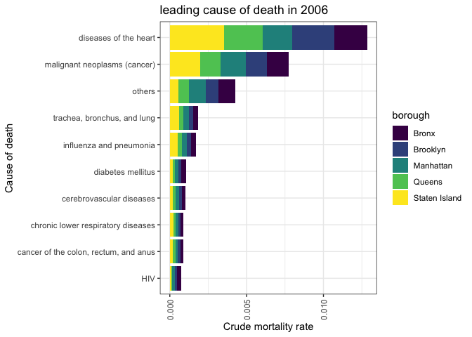

``` r
yr12
```

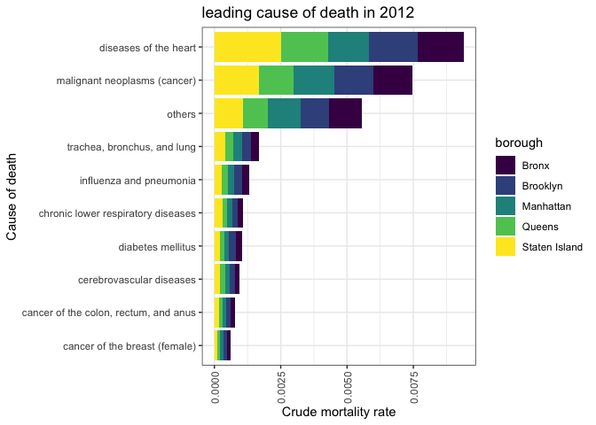

``` r
yr14
```

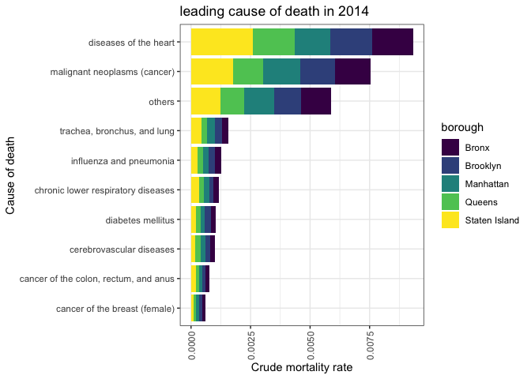

``` r
# death by gender in each borough by year
gender_death_cause = gender_death_data2 %>%
  group_by(gender, cause_of_death) %>%
  summarise(average_death = sum(number_cs_boro_gdr)/11) %>%
  top_n(n = 10, wt = average_death) %>%
  arrange(gender, desc(average_death))

gender_death_cause2 = gender_death_data2 %>%
  group_by(gender, cause_of_death, borough) %>%
  summarise(average_death_br = sum(number_cs_boro_gdr)/11) %>%
  top_n(n = 10, wt = average_death_br) %>%
  arrange(gender, desc(average_death_br))

female1 = gender_death_cause2 %>% 
  filter(gender == "female") %>%
  ggplot(aes(x = reorder(cause_of_death, average_death_br), y = average_death_br, fill = borough)) +
  geom_bar(stat = "identity") +

  labs(x = "Cause of death", 
         y = "Number of death", 
         title = "leading cause of death for female") + 
theme_bw()+
   theme(axis.text.x = element_text(angle=90, vjust=0.6)) +
  
  viridis::scale_fill_viridis(discrete = TRUE) 

male1 = gender_death_cause2 %>% 
  filter(gender == "male") %>%
  ggplot(aes(x = reorder(cause_of_death, average_death_br), y = average_death_br, fill = borough)) +
  geom_bar(stat = "identity" ) +
  ylim(c(0, 10000)) +
  
theme_bw()+
   theme(axis.text.x = element_text(angle=90, vjust=0.6)) +
   labs(x = "Cause of death", 
         y = "Number of death", 
         title = "leading cause of death for male") +
  viridis::scale_fill_viridis(discrete = TRUE) 

ggarrange(male1, female1, ncol=2, nrow=1, common.legend = TRUE, legend="bottom")
```

    ## Warning: Removed 1 rows containing missing values (geom_bar).

    ## Warning: Removed 1 rows containing missing values (geom_bar).

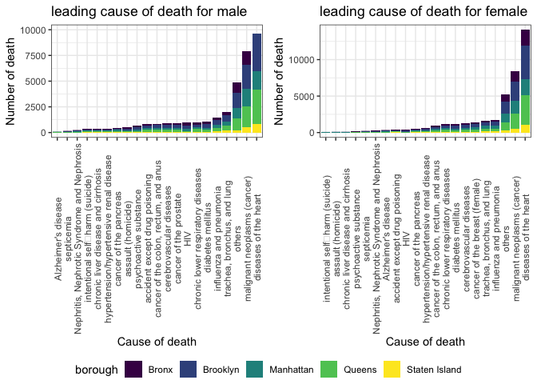

``` r
gender_death_data2 %>%
   group_by(year, gender) %>%
  summarise(total_death = sum(number_cs_boro_gdr)) %>%
  ggplot(aes(x = year, y = total_death, color = gender)) +
  geom_point() +
  geom_line() + 
   labs(title = "Number of death in different gender group in New York City",
             x = "Year",
             y = "Number of death")  + 
  theme_bw()+
  viridis::scale_color_viridis(discrete = TRUE) +
   theme(axis.text.x = element_text(angle=90, vjust=0.6))
```

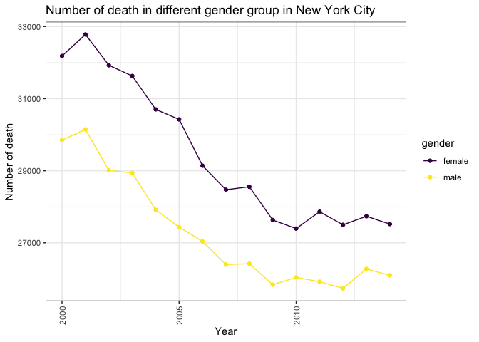 The number of deaths for female is overall greater than the number of deaths for male. The curves for the two groups are parallel to each other over time. We assume there is some difference between men and women in terms of the number of deaths. But the difference was not due to the change of time.

``` r
race_death_data2 = race_death_data2 %>%
  ungroup() %>%
  mutate(race = case_when(
    race == 1 ~ "Hispanic",
    race == 3 ~ "Asian Non-Hispanic",
    race == 4 ~ "White Non-Hispanic",
    race == 5 ~ "Black Non-hispanic"
  )) 

# identify the top leading cause in NYC


race_death_cause  = race_death_data2%>%
  group_by(race, cause_of_death) %>%
  summarise(cs_death_race = sum(borough_race_death)/11)  %>% # average yearly death from 2004 to
  top_n(n = 10, wt = cs_death_race) %>%
  arrange(race, desc(cs_death_race)) 
```

``` r
race_death_cd = merge(race_death_data2, race_death_cause) %>%
  group_by(race, cause_of_death, borough) %>%
  summarise(race_ds_br = sum(borough_race_death)/10) 

race_death_cd %>% 
  filter(race == "Hispanic") %>%
  ggplot(aes(x = reorder(cause_of_death, race_ds_br), y = race_ds_br, fill = borough)) +
  geom_bar(stat = "identity") +

  labs(x = "Cause of death", 
         y = "Number of death", 
         title = "leading cause of death for Hispanic") + 
theme_bw() +
   theme(axis.text.x = element_text(angle=90, vjust=0.6)) +
  viridis::scale_fill_viridis(discrete = TRUE) 
```

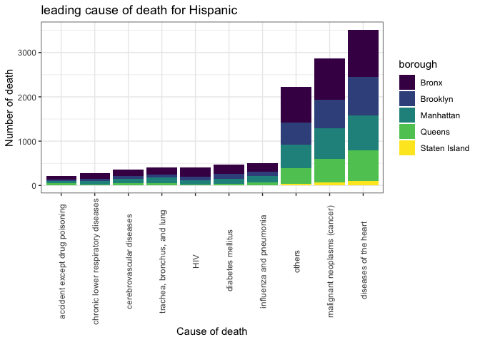

``` r
race_death_cd %>% 
  filter(race == "Asian Non-Hispanic") %>%
  ggplot(aes(x = reorder(cause_of_death, race_ds_br), y = race_ds_br, fill = borough)) +
  geom_bar(stat = "identity") +

  labs(x = "Cause of death", 
         y = "Number of death", 
         title = "leading cause of death for Asian") +
  theme_bw()+
   theme(axis.text.x = element_text(angle=90, vjust=0.6)) +
  viridis::scale_fill_viridis(discrete = TRUE) 
```

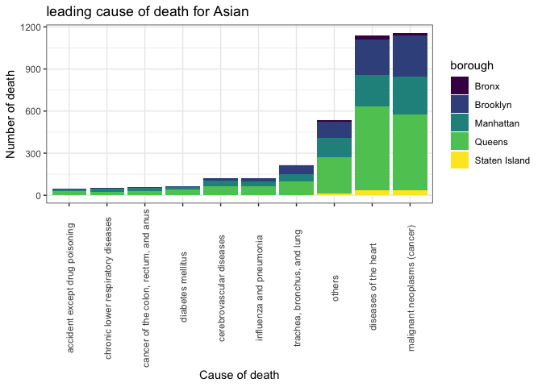

``` r
race_death_cd %>% 
  filter(race == "White Non-Hispanic") %>%
  ggplot(aes(x = reorder(cause_of_death, race_ds_br), y = race_ds_br, fill = borough)) +
  geom_bar(stat = "identity") +

  labs(x = "Cause of death", 
         y = "Number of death", 
         title = "leading cause of death for White") + 
theme_bw()+
   theme(axis.text.x = element_text(angle=90, vjust=0.6)) +
  viridis::scale_fill_viridis(discrete = TRUE) 
```

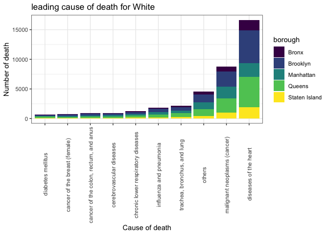

``` r
race_death_cd %>% 
  filter(race == "Black Non-hispanic") %>%
  ggplot(aes(x = reorder(cause_of_death, race_ds_br), y = race_ds_br, fill = borough)) +
  geom_bar(stat = "identity") +

  labs(x = "Cause of death", 
         y = "Number of death", 
         title = "leading cause of death for Black") + 
theme_bw() +
   theme(axis.text.x = element_text(angle=90, vjust=0.6)) +
  viridis::scale_fill_viridis(discrete = TRUE) 
```


``` r
race_death_data2 %>%
  group_by(race, year) %>%
  summarise(total_death_yr_rc = sum(borough_race_death)) %>%
  ggplot(aes(x = year, y = total_death_yr_rc, color = race)) +
  geom_line() +
  geom_point() +
  theme_bw() +
    viridis::scale_fill_viridis(discrete = TRUE) +
  labs(x = "Year", 
         y = "Number of death", 
         title = "Change in total number of death in each race group") + 
  viridis::scale_fill_viridis(discrete = TRUE)  
```

    ## Scale for 'fill' is already present. Adding another scale for 'fill',
    ## which will replace the existing scale.

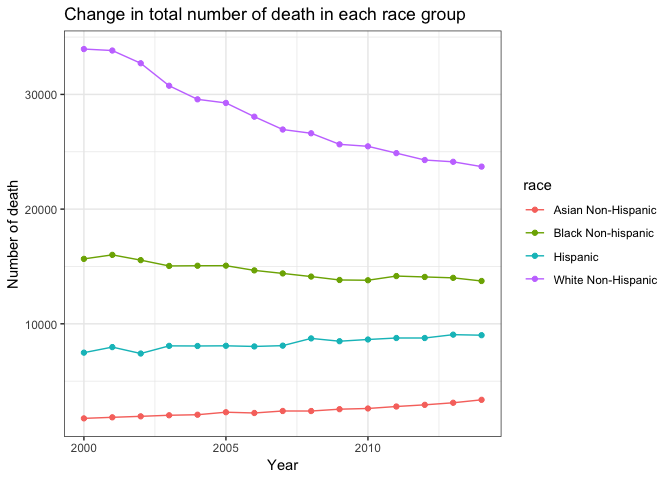

``` r
# leading cause of death in each age group
age_death_cause = age_death_data3 %>%
  group_by(age_group, cause_of_death) %>%
  summarise(av_death_age = sum(borough_age_death)/11 ) %>%
  top_n(n = 10, wt = av_death_age) %>%
  arrange(age_group, desc(av_death_age)) 

# not much useful info in the newborn and under 1 group 
age_death_cause = age_death_cause %>%
  filter(age_group == "Premature Death" | age_group == ">65 age death")
```

``` r
age_death_data3 = merge(age_death_data3, age_death_cause) %>%
  group_by(cause_of_death, age_group, borough) %>%
  summarise(br_death_age = sum(av_death_age)/11) 

over_65_2 = age_death_data3 %>%
  filter(age_group == ">65 age death") %>%
  ggplot(aes(x = reorder(cause_of_death, br_death_age), y = br_death_age, fill = borough)) +
  geom_bar(stat = "identity") + 
  labs(x = "Cause of death", 
         y = "Number of death", 
         title = "leading cause of death for over 65 year old group ") + 
theme_bw() +
   theme(axis.text.x = element_text(angle=90, vjust=0.6)) +
  viridis::scale_fill_viridis(discrete = TRUE)  


premature2 = age_death_data3 %>%
  filter(age_group == "Premature Death") %>%
  ggplot(aes(x = reorder(cause_of_death, br_death_age), y = br_death_age, fill = borough)) +
  geom_bar(stat = "identity") + 
  labs(x = "Cause of death", 
         y = "Number of death", 
         title = "leading cause of death for premature death") + 
theme_bw()+
   theme(axis.text.x = element_text(angle=90, vjust=0.6)) +
  viridis::scale_fill_viridis(discrete = TRUE) 


ggarrange(over_65_2, premature2, ncol=2, nrow=1, common.legend = TRUE, legend="bottom")
```

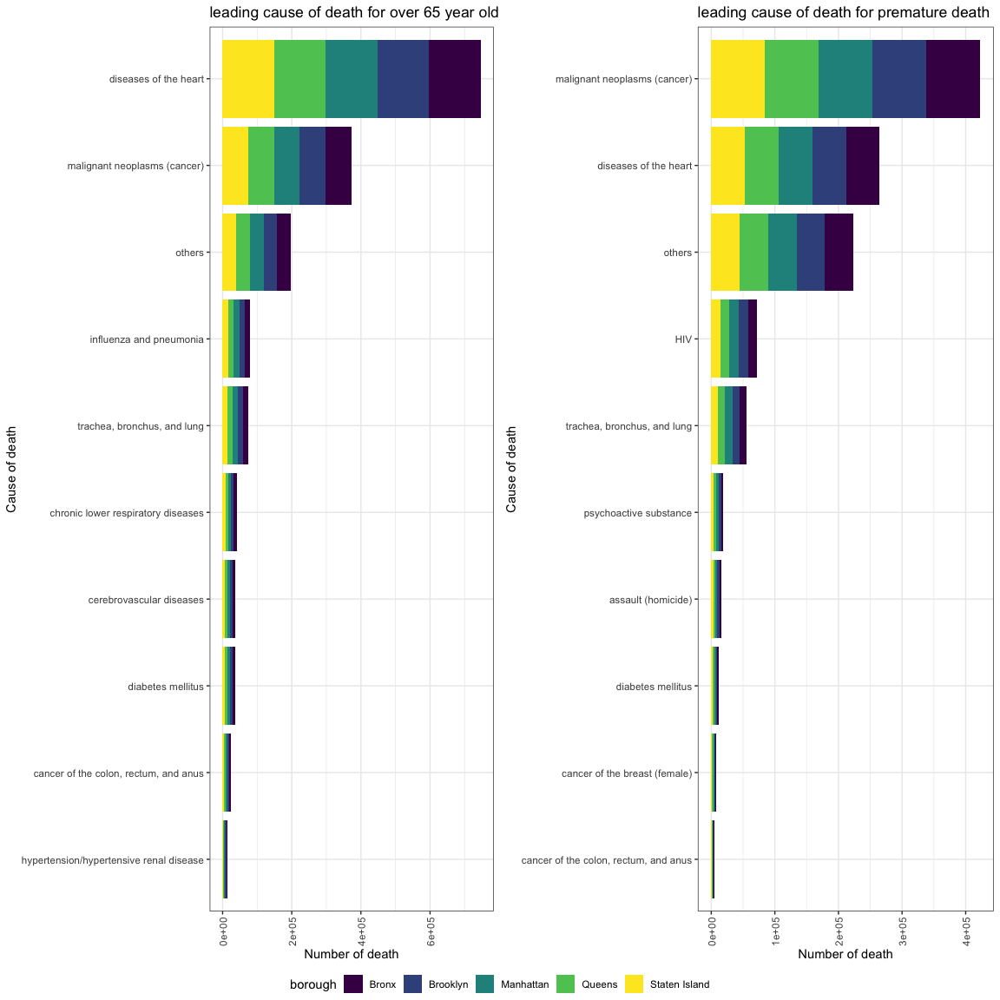
