Vital Statistics Data Analysis in New York City
================
Yi Xiao (yx2510) | Xue Yang (xy2397) | Kangkang Zhang (kz2334) | Yue Zhao (yz3297)
05/12/2018

------------------------------------------------------------------------

1 **Motivation**
----------------

Vital statistics including birth and mortality data is of critical importance in assesssing community health status. Birth rate, leading cause of death and mortality rate often serve as cornerstone in formulating public health policies.

Motality data, for example, offers a snapshot of current health problems and knowing the causes of death, especially the avoidable and treatable ones, helps us to establish intervention for better outcomes. By investigating the trend of a specific cause of death over time, we can also identify consistent risk in a specific groups and evaluate the effect of a certain public health policy. Disparity in mortality rate, premature death and cause of death in different race and gender can indicate socioeconomic inequility.

Birth data, similarly, provide essential information from another prospective. Different maternal age and maternal nativity can be differently associated with offspring health outcome. Advanced maternal age, for instance, is linked with negative infant health and infant health condition can also vary between US born and foreign born. Thus, understanding the pattern of distribution of those factors in different communities can indicate possible public health problems.

In this project, we are interested in determining the mortality rate and leading causes of death in New York City and explore whether there is a differnt pattern by sex, race, age group, borough of residency and year. For the birth data, we would like to examine maternal factors such as maternal age, nativity and marrital status, and investigate how they changed over time or across different borough in New York City.

2 **Related work and questions**
--------------------------------

We came acrossed some nationwide and worldwide data on leading cause of death this semester. This inspired us to explore the birth and death information in New York City. Initally, we planned to calculate birth and mortality rate in different age/race/origin of birth/group and build a regression model. However, we failed to found crossed data on population in a certain age/race/redidency group since all the data are aggregated rather than individual. Then we decided to symply identify leading cause of death by different demographic characteristics as well as maternal characteristics in different borough. A major issue in this project is the presence of a large amount of missing data and how to deal with them.

3. **Dataset**
--------------

Datasets used are the birth and death micro SAS Datasets \[Year(s)\] from National Vital Statistics System (2000 to 2014). Population data in each community district is obtained from NYC Open Data. Community District Dataset was chosen among three datasets for us to better examine the interested factors in each single year (the other two with 3 year and 5 year aggragate data respectively). Dataset used can be retrieved here. ("<https://drive.google.com/drive/folders/1ufT6kp6GUqnZYCR2OHgY3UIuJpQcEG2d?usp=sharing>")

4. Birth data
-------------

### 4.1 Data tidy

#### Load and clean the birth data from community\_district source

``` r
# load and import community_district dataset
birth_data = 
  tibble(file_name = list.files(path = "./data/birth_data/community_district")) %>% 
  mutate(output = purrr::map(str_c("./data/birth_data/community_district/", file_name), haven::read_sas)) %>%
  unnest() %>% 
  separate(file_name, c("name", "year", "del"), sep = c(6, 8)) %>% 
  select(-name, -del) %>%
  mutate(year = str_c("20", year), year = as.numeric(year))


# import cd code dataset
cd_code_data = 
  read_csv("./data/New_York_City_Population_By_Community_Districts 16.09.03.csv") %>%
  janitor::clean_names() %>%
  select(borough, cd_number, cd_name) %>% 
  rename(cd = cd_number) %>% 
  mutate(cd = ifelse(borough == "Bronx", cd + 200, cd)) %>% 
  mutate(cd = ifelse(borough == "Brooklyn", cd + 300, cd)) %>% 
  mutate(cd = ifelse(borough == "Manhattan", cd + 100, cd)) %>% 
  mutate(cd = ifelse(borough == "Queens", cd + 400, cd)) %>% 
  mutate(cd = ifelse(borough == "Staten Island", cd + 500, cd)) 

# join two dataset
birth_data_un = 
  birth_data %>% 
  unnest() %>% 
  left_join(cd_code_data, by = "cd") 
```

The community\_district dataset contains 885 rows x 364 columns, with each row representing a corresponding birth record from year 2000 to 2014 in different community district in New York City. Each varaible in the column records number of subjects falling into that specific category.Since the dataset is large, we decided to split the dataset into several subsets and examine those individual and crossed variables separately.

#### Deal with missing value

we finally select We observed a presence of a large number of missing values in the dataset. We first checked the number and proportion of the missing values in each column

``` r
# check for the number and proprotion of missing value
missing_value = 
  birth_data_un %>% 
  summarise_all(funs(sum(is.na(.)))) %>% 
  gather(term, num_na, everything()) %>% 
  mutate(percent = num_na/885) 
```

Since a high proportion of missing data in one single variable can bias our study, we set the cutoff at 20% and filter out the variable that does not meet the criteria. Hereby, we obtained the following variables:

-   Individual variables: maternal age, maternal nativity, maternal marital status, infant sex;

-   Crossed variables: maternal nativity and maternal age

### 4.2 Exploratory analysis

#### Fill the missing value and tidy the data

We first calculated the "delta" and "percent", which indicate the differences in value and percent change between the total number and the sum of non missing value. If the "delta" is small, we can conclued that missing value does not have a great impact on our analysis. In this case, we filled the missing value with the same data from last year in the same community district, if there were NAs for continuous three year, we filled the NA with 0.

#### Individual Variables

**Maternal age**

``` r
# data maternal age

birth_data_un %>% 
  select(year, cd, birthtot, age1tot:age9tot) %>%
  gather(maternal_age, num, age1tot:age9tot) %>% 
  group_by(year, cd, birthtot) %>% 
  summarise(ttl = sum(num, na.rm = TRUE)) %>% 
  mutate(delta = birthtot - ttl, percent = delta/birthtot) %>% 
  arrange(desc(delta))
```

    ## # A tibble: 885 x 6
    ## # Groups:   year, cd [885]
    ##     year    cd birthtot   ttl delta percent
    ##    <dbl> <dbl>    <dbl> <dbl> <dbl>   <dbl>
    ##  1  2003   102      842   833     9 0.0107 
    ##  2  2012   105      579   570     9 0.0155 
    ##  3  2000   103     2320  2312     8 0.00345
    ##  4  2000   401     2533  2525     8 0.00316
    ##  5  2002   316     1446  1438     8 0.00553
    ##  6  2002   411      675   667     8 0.0119 
    ##  7  2002   501     2447  2439     8 0.00327
    ##  8  2003   209     2694  2686     8 0.00297
    ##  9  2005   112     2892  2884     8 0.00277
    ## 10  2005   313     1171  1163     8 0.00683
    ## # ... with 875 more rows

``` r
maternal_age_plot_data =
  birth_data_un %>%
  select(year, cd, cd_name, borough, birthtot, age1tot:age9tot) %>%
  gather(maternal_age, num, age1tot:age9tot) %>%
  arrange(cd, maternal_age, year) %>% 
  mutate(num = ifelse(is.na(num) & year != 2000, lag(num), num)) %>% 
  mutate(num = ifelse(is.na(num) & year != 2000, lag(num, 2), num)) %>% 
  mutate(num = ifelse(is.na(num), 0, num)) %>% 
  mutate(new_age = case_when(
    maternal_age %in% c("age1tot", "age2tot") ~ "< 18",
    maternal_age %in% c("age3tot", "age4tot") ~ "18 - 24",
    maternal_age == "age5tot" ~ "25 - 29",
    maternal_age == "age6tot" ~ "30 - 34",
    maternal_age == "age7tot" ~ "35 - 39",
    TRUE                      ~  "40 +"
  )) %>% 
  group_by(year, borough, new_age) %>% 
  summarise(number = sum(num)) 
```

For the data for maternal age, the largest "delta" was 9 and percent was 0.0107, which indicate a minor influence. Therefore, we filled the NA in the way indicated above, and then tidy the new non-missing data.

**Maternal nativity**

``` r
# data for maternal nativity

birth_data_un %>% 
  select(year, cd, birthtot, nat1tot:nat2tot) %>%
  gather(born_demo, num, nat1tot:nat2tot) %>% 
  group_by(year, cd, birthtot) %>% 
  summarise(ttl = sum(num, na.rm = TRUE)) %>% 
  mutate(delta = birthtot - ttl, percent = delta/birthtot) %>% 
  arrange(desc(percent))
```

    ## # A tibble: 885 x 6
    ## # Groups:   year, cd [885]
    ##     year    cd birthtot   ttl delta percent
    ##    <dbl> <dbl>    <dbl> <dbl> <dbl>   <dbl>
    ##  1  2003   212     1919  1875    44  0.0229
    ##  2  2002   104      818   800    18  0.0220
    ##  3  2001   212     1964  1921    43  0.0219
    ##  4  2000   103     2320  2275    45  0.0194
    ##  5  2003   110     1669  1638    31  0.0186
    ##  6  2005   203     1293  1271    22  0.0170
    ##  7  2004   105      481   473     8  0.0166
    ##  8  2002   103     2167  2131    36  0.0166
    ##  9  2002   202      912   897    15  0.0164
    ## 10  2006   203     1353  1331    22  0.0163
    ## # ... with 875 more rows

``` r
ma_nat_plot_data =
  birth_data_un %>% 
  select(year, cd, cd_name, borough, birthtot, nat1tot:nat2tot) %>%
  gather(ma_nat, num, nat1tot:nat2tot) %>%
  arrange(cd, ma_nat, year) %>% 
  mutate(num = ifelse(is.na(num) & year != 2000, lag(num), num)) %>% 
  mutate(num = ifelse(is.na(num) & year != 2000, lag(num, 2), num)) %>% 
  mutate(num = ifelse(is.na(num), 0, num)) %>% 
  mutate(new_ma_nat = ifelse(ma_nat == "nat1tot", "US Born", "Foreign Born")) %>% 
  group_by(year, borough, new_ma_nat) %>% 
  summarise(number = sum(num))
```

For the data for maternal nativity, the largest "delta" was 44, with percent 0.0229, we filedl the NA similarly.

**Maternal marital status **

``` r
# data for maternal marital status 

birth_data_un %>% 
  select(year, cd, birthtot, mar1tot:mar2tot) %>%
  gather(marry_status, num, mar1tot:mar2tot) %>% 
  group_by(year, cd, birthtot) %>% 
  summarise(ttl = sum(num, na.rm = TRUE)) %>% 
  mutate(delta = birthtot - ttl, percent = delta/birthtot) %>% 
  arrange(desc(percent))
```

    ## # A tibble: 885 x 6
    ## # Groups:   year, cd [885]
    ##     year    cd birthtot   ttl delta  percent
    ##    <dbl> <dbl>    <dbl> <dbl> <dbl>    <dbl>
    ##  1  2002   205     2596  2595     1 0.000385
    ##  2  2000   101      436   436     0 0       
    ##  3  2000   102      745   745     0 0       
    ##  4  2000   103     2320  2320     0 0       
    ##  5  2000   104      777   777     0 0       
    ##  6  2000   105      436   436     0 0       
    ##  7  2000   106     1259  1259     0 0       
    ##  8  2000   107     2568  2568     0 0       
    ##  9  2000   108     2734  2734     0 0       
    ## 10  2000   109     1584  1584     0 0       
    ## # ... with 875 more rows

``` r
marry_plot_data =
  birth_data_un %>% 
  select(year, cd, cd_name, borough, birthtot, mar1tot:mar2tot) %>%
  gather(marry_status, num, mar1tot:mar2tot) %>%
  arrange(cd, marry_status, year) %>% 
  mutate(num = ifelse(is.na(num) & year != 2000, lag(num), num)) %>% 
  mutate(num = ifelse(is.na(num) & year != 2000, lag(num, 2), num)) %>% 
  mutate(num = ifelse(is.na(num), 0, num)) %>% 
  mutate(new_marry_status = ifelse(marry_status == "mar1tot", "Married", "Not Married")) %>% 
  group_by(year, borough, new_marry_status) %>% 
  summarise(number = sum(num))  
```

For the data for parity, the largest "delta" was 1, with percent 0.000385. We filled the missing value with the same method.

**Infant sex**

``` r
# data for infant sex
birth_data_un %>% 
  select(year, cd, birthtot, sex1tot:sex2tot) %>%
  gather(infant_sex, num, sex1tot:sex2tot) %>% 
  group_by(year, cd, birthtot) %>% 
  summarise(ttl = sum(num, na.rm = TRUE)) %>% 
  mutate(delta = birthtot - ttl, percent = delta/birthtot) %>% 
  arrange(desc(percent))
```

    ## # A tibble: 885 x 6
    ## # Groups:   year, cd [885]
    ##     year    cd birthtot   ttl delta percent
    ##    <dbl> <dbl>    <dbl> <dbl> <dbl>   <dbl>
    ##  1  2000   101      436   436     0       0
    ##  2  2000   102      745   745     0       0
    ##  3  2000   103     2320  2320     0       0
    ##  4  2000   104      777   777     0       0
    ##  5  2000   105      436   436     0       0
    ##  6  2000   106     1259  1259     0       0
    ##  7  2000   107     2568  2568     0       0
    ##  8  2000   108     2734  2734     0       0
    ##  9  2000   109     1584  1584     0       0
    ## 10  2000   110     1785  1785     0       0
    ## # ... with 875 more rows

``` r
infant_sex_plot_data =
  birth_data_un %>% 
  select(year, cd, cd_name, borough, birthtot, sex1tot:sex2tot) %>%
  gather(infant_sex, num, sex1tot:sex2tot) %>%
  arrange(cd, infant_sex, year) %>% 
  mutate(num = ifelse(is.na(num) & year != 2000, lag(num), num)) %>% 
  mutate(num = ifelse(is.na(num) & year != 2000, lag(num, 2), num)) %>% 
  mutate(num = ifelse(is.na(num), 0, num)) %>% 
  mutate(new_infant_sex = ifelse(infant_sex == "sex1tot", "Male", "Female")) %>% 
  group_by(year, borough, new_infant_sex) %>% 
  summarise(number = sum(num))  
```

No missing value was observed in the infant gender dataset.

#### Crossed Variables

**Maternal nativity and Maternal age**

``` r
# data for maternal nativity * maternal age
birth_data_un %>% 
  select(year, cd, birthtot, nat1tot_a1, nat2tot_a1, nat1tot_a2, nat2tot_a2, nat1tot_a3, nat2tot_a3, nat1tot_a4, nat2tot_a4) %>%
  gather(nativity_age, num, nat1tot_a1:nat2tot_a4) %>% 
  group_by(year, cd, birthtot) %>% 
  summarise(ttl = sum(num, na.rm = TRUE)) %>% 
  mutate(delta = birthtot - ttl, percent = delta/birthtot) %>% 
  arrange(desc(percent))
```

    ## # A tibble: 885 x 6
    ## # Groups:   year, cd [885]
    ##     year    cd birthtot   ttl delta percent
    ##    <dbl> <dbl>    <dbl> <dbl> <dbl>   <dbl>
    ##  1  2003   102      842   821    21  0.0249
    ##  2  2003   212     1919  1875    44  0.0229
    ##  3  2002   104      818   800    18  0.0220
    ##  4  2001   212     1964  1921    43  0.0219
    ##  5  2000   103     2320  2275    45  0.0194
    ##  6  2004   105      481   472     9  0.0187
    ##  7  2003   110     1669  1638    31  0.0186
    ##  8  2002   101      389   382     7  0.0180
    ##  9  2004   101      616   605    11  0.0179
    ## 10  2005   203     1293  1271    22  0.0170
    ## # ... with 875 more rows

``` r
birth_nat_age_plot_data =
  birth_data_un %>% 
  select(year, cd, cd_name, borough, birthtot, nat1tot_a1, nat2tot_a1, nat1tot_a2, nat2tot_a2, nat1tot_a3, nat2tot_a3, nat1tot_a4, nat2tot_a4) %>%
  gather(nativity_age, num, nat1tot_a1:nat2tot_a4) %>%
  arrange(cd, nativity_age, year) %>% 
  mutate(num = ifelse(is.na(num) & year != 2000, lag(num), num)) %>% 
  mutate(num = ifelse(is.na(num) & year != 2000, lag(num, 2), num)) %>% 
  mutate(num = ifelse(is.na(num), 0, num)) %>% 
  separate(nativity_age, c("nat", "age"), sep = "tot_") %>%
  mutate(new_nat = ifelse(nat == "nat1", "US born", "Foreign born"),
         new_age = case_when(
    age == "a1" ~ "< 20",
    age == "a2" ~ "20 - 29",
    age == "a3" ~ "30 - 39",
    TRUE                      ~  "40 +"
  )) %>% 
  group_by(year, borough, new_age, new_nat) %>% 
  summarise(number = sum(num))
```

"Delta" and percent as large as 21 and 0.0249 were observed for infant sex and maternal nativity cross data, therefore, we filled NA with the same method.

### 4.3 Visualization

#### Individual Variables

**Maternal Age**

``` r
# the birth trend in different maternal age in NYC
maternal_age_plot_data %>%
  group_by(year, new_age) %>% 
  summarise(number = sum(number)) %>% 
  mutate(percent = number/ sum(number)) %>% 
  ggplot(aes(x = year, y = percent, color = new_age)) +
  geom_point() +
  geom_line() +
  labs(title = "Birth trend in different maternal age group in NYC",
      y = "Proportion of number of  birth",
      x = "Year",
      color = "Maternal Age") +
  theme_bw() +
  scale_x_continuous(breaks=seq(2000, 2014, 1)) +
  viridis::scale_color_viridis(discrete = TRUE) +
  theme(legend.position = "bottom", plot.title = element_text(hjust = 0.5))
```

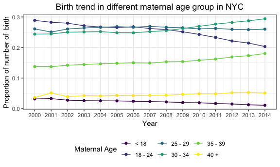 As the plot shows, proportion of under-18-year-old mother remained low from 2000 to 2014. Advanced maternal age has been a clearly growing trend over the time period as indicated by an increase in the proportion of birth contributed by 35-39 maternal age group and a decrease in 18-24 group. This, however, could have negative public health impliacation as advanced maternal age is associated with poor offspring health and meanwhile put mothers at higher risks.

**Maternal Nativity**

``` r
# the birth trend in different maternal nativity in NYC for each boro
ma_nat_plot_data %>%
  group_by(year, borough) %>% 
  mutate(percent = number/sum(number)) %>% 
  ggplot(aes(x = year, y = percent, color = new_ma_nat)) +
  geom_point() +
  geom_line() +
  facet_grid( ~ borough) +
  labs(title = "Birth trend in different maternal nativity in NYC for each borough",
      y = "Proportion of number of birth",
      x = "Year",
      color = "Maternal Nativity") +
  theme_bw() +
  scale_x_continuous(breaks=seq(2000, 2014, 5)) +
  viridis::scale_color_viridis(discrete = TRUE) +
  theme(legend.position = "bottom", plot.title = element_text(hjust = 0.5))
```

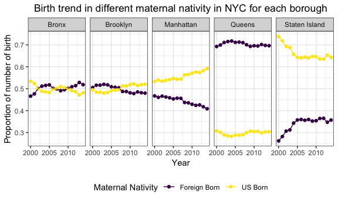

According to the plot above, Maternal nativity status was equally distributed in Bronx and Brooklyn. Queens had a noticeabley high proportion of foreign-born mothers at 70%. In the opposite, only about 35% mothers were Foreign born in Staten Island. This statistics is important when we examine the disease pattern in differnet communities, as certain disease is associated with certain lifestyle brough along of birth of origin.

**Maternal Marital Status**

``` r
#the birth trend in different marry status in NYC for each boro
marry_plot_data %>%
  group_by(year, borough) %>% 
  mutate(percent = number/sum(number)) %>% 
  ggplot(aes(x = year, y = percent, color = new_marry_status)) +
  geom_line() +
  geom_point() +
  facet_grid( ~ borough) +
  labs(title = "Birth trend in different maternal marry status in NYC for each borough",
      y = "Proportion of number of birth",
      x = "Year",
      color = "Maternal marital status") +
  theme_bw() +
  scale_x_continuous(breaks=seq(2000, 2014, 5)) +
  viridis::scale_color_viridis(discrete = TRUE) +
  theme(legend.position = "bottom", plot.title = element_text(hjust = 0.5))
```

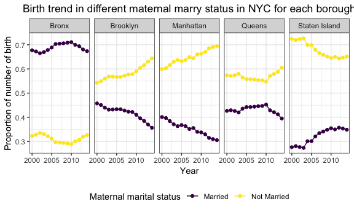

Most mother were married, except for Bronx. However, we can observe an uptrend for un-married mothers in Brooklyn and Manhattan and an opposite trend in Staten Island.

**Infant Sex**

``` r
# the birth trend in different sex in NYC for each boro
infant_sex_plot_data %>%
  group_by(year, borough) %>% 
  mutate(percent = number/sum(number)) %>% 
  ggplot(aes(x = year, y = percent, color = new_infant_sex)) +
  geom_line() +
  geom_point() +
  facet_grid( ~ borough) +
  labs(title = "Birth trend in different infant sex in NYC for each borough",
      y = "Proportion of number of birth",
      x = "Year",
      color = "Infant sex") +
  theme_bw() +
  scale_x_continuous(breaks=seq(2000, 2014, 5)) +
  viridis::scale_color_viridis(discrete = TRUE) +
  theme(legend.position = "bottom", plot.title = element_text(hjust = 0.5))
```

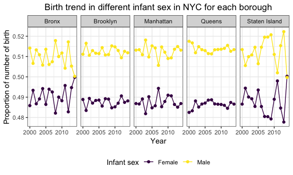

In each borough, the proportion of male and female infant are very close to each other, flunctuating around 0.51 and 0.49, with the proportion of male infant always being slightly larger than that of female infant.

#### Crossed Variables

**Maternal Nativity × Maternal Age**

``` r
birth_nat_age_plot_data =
  birth_data_un %>% 
  select(year, cd, cd_name, borough, birthtot, nat1tot_a1, nat2tot_a1, nat1tot_a2, nat2tot_a2, nat1tot_a3, nat2tot_a3, nat1tot_a4, nat2tot_a4) %>%
  gather(nativity_age, num, nat1tot_a1:nat2tot_a4) %>%
  arrange(cd, nativity_age, year) %>% 
  mutate(num = ifelse(is.na(num) & year != 2000, lag(num), num)) %>% 
  mutate(num = ifelse(is.na(num) & year != 2000, lag(num, 2), num)) %>% 
  mutate(num = ifelse(is.na(num), 0, num)) %>% 
  separate(nativity_age, c("nat", "age"), sep = "tot_") %>%
  mutate(new_nat = ifelse(nat == "nat1", "US born", "Foreign born"),
         new_age = case_when(
    age == "a1" ~ "< 20",
    age == "a2" ~ "20 - 29",
    age == "a3" ~ "30 - 39",
    TRUE                      ~  "40 +"
  )) %>% 
  group_by(year, borough, new_age, new_nat) %>% 
  summarise(number = sum(num))

birth_nat_age_plot_data %>% 
  group_by(year, new_nat, new_age) %>% 
  summarise(number = sum(number)) %>%
  group_by(year, new_nat) %>% 
  mutate(percent = number/sum(number)) %>% 
  ggplot(aes(x = year, y = percent, color = new_age)) +
  geom_point() +
  geom_line() +
  facet_grid( ~ new_nat) + 
  labs(title = "Birth trend in different maternal age in NYC for each maternal nativity",
      y = "Proportion of number of  birth",
      x = "Year",
      color = "Maternal age") +
  theme_bw() +
  scale_x_continuous(breaks=seq(2000, 2014, 5)) +
  viridis::scale_color_viridis(discrete = TRUE) +
  theme(legend.position = "bottom", plot.title = element_text(hjust = 0.5))
```

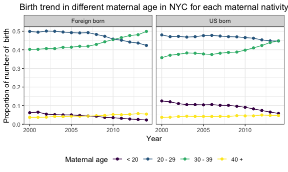 Here agin, we observed a trend of advanced maternal age both among US and foreign-born indicated by a decrease in &lt;29 year old mothers and an increase in 30-29 year old mothers.

5. Death data
-------------

### 5.1 load the data

``` r
#import death data from 2004 to 2014
name = list.files(path = "./data", full.names = TRUE, pattern = "*.sas7bdat") 
cd_data =  map_df(name, read_sas)  %>%
  janitor::clean_names()
year = as.data.frame(rep(2000:2014, each = 59)) 

# add a column "year"
cd_data = cbind(year, cd_data) 
colnames(cd_data)[1] = "year"

community_district = unique(cd_data$community_district)
cd_number = c(101:112, 201:212, 301: 318, 401:414, 501:503)
community_district = as.tibble(cbind(community_district, cd_number))

cd_data = merge(cd_data, community_district , by = "community_district")


# import population data
cd_number2 = c(201:212, 301: 318, 101:112, 401:414, 501:503)
pop_data2 = read_csv("./data/New_York_City_Population_By_Community_Districts 16.09.03.csv") %>%
 janitor::clean_names() 
pop_data2 = cbind(cd_number2, pop_data2) %>%
  select(borough, cd_number2, cd_name, x2000_population, x2010_population) %>%
  rename("cd_number" = "cd_number2")
  # standardize the cd_number

  


  
# merge the two datasets
my_data = merge(pop_data2, cd_data, by = "cd_number") 
 
my_tidy_data = my_data %>% # we'll use 2000 year population data for 2000 - 2009, and 2010 year data for 2010 -2014 
  mutate(population = ifelse(year < 2010, my_data$x2000_population, my_data$x2010_population)) %>%
  select(-c(x2000_population, x2010_population)) %>% 
  mutate(cd_name = as.factor(cd_name)
         ) %>%
  select(c(cd_number:cd_name, year:population))
```

The generated dataset consists of 885 observations and 1315 columns. Each observation records information on population and death statistics in one of 59 community districts in New York City. Variables in the original dataset include sex, age, ethnicity and cause of death and their cross variable with each other. Since we are interested in cause of death in this project, we only kept cause of death and its cross information with other demographic variables.

Cause of death is denoted with c1 to c22, which represent Deaths due to septicemia, Deaths due to HIV, Deaths due to malignant neoplasms (cancer), Deaths due to cancer of the colon, rectum, and anus, Deaths due to cancer of the pancreas, Deaths due to trachea, bronchus, and lung, Deaths due to cancer of the breast (female), Deaths due to cancer of the prostate, Deaths due to diabetes mellitus, Deaths due to use of or poisoning by psychoactive substance excluding alcohol and tobacco, Deaths due to Alzheimer's disease, Deaths due to diseases of the heart, Deaths due to essential hypertension and hypertensive renal disease, Deaths due to cerebrovascular diseases, Deaths due to influenza and pneumonia, Deaths due to chronic lower respiratory diseases, Deaths due to chronic liver disease and cirrhosis, Deaths due to Nephritis, Nephrotic Syndrome and Nephrosis, Deaths due to accident except drug poisoning, Deaths due to intentional self‐harm (suicide), Deaths due to assault (homicide), respectively.

### 5.2 tidy the data

#### dealting with missing value

``` r
missing_value = 
  my_tidy_data %>% 
  summarise_all(funs(sum(is.na(.)))) %>% 
  gather(term, num_na, everything()) %>% 
  mutate(percent = num_na/nrow(my_tidy_data)) %>% 
  filter(percent > 0.2) 
```

We filtered those variables with more than 20% of missing value and found `nrow(missing_value)` fell into this category. However, it is quite reasonable that no people from a certain age or gender group died of a certain disease in a specific year and neighbourhood and thus resulted in absence of recording. Missing data could suggest 0 death and removing them will lead to loss of valuable information. Therefore, we kept those missing value in our dataset.

#### split the dataset into several subsets

\*\* dataset without demographic characteristcs \*\*

``` r
# we are first dealing with death infomation without accounting for other demographic characteristics
total_death_data = my_tidy_data %>%
  select(cd_number:year, x1: x22, population, total) %>%
  gather(key = "cause_of_death", value = number, x1:x22) 
```

\*\* dataset crossed with other gender \*\*

``` r
# cause of death crossed with gender
gender_death_data = my_tidy_data %>%
   select(cd_number : year, c1male :c22female) %>%
   gather (key = "cause_of_death", value = "number", c1male : c22female)   

# split "death cause/gender" into gender
  gender_death_data = gender_death_data %>% 
   mutate(gender = ifelse(str_detect(gender_death_data$cause_of_death, "female"), "female", "male"))

  #split "death cause/gender" into cause of death
gender_death_data =gender_death_data %>%
 mutate(cause_of_death = 
       substr(gender_death_data$cause_of_death,1,str_locate(gender_death_data$cause_of_death, "[0-9][a-zA-Z]")[,1])
 )  

# aggregate cd-level data into borough-level
gender_death_data2 = gender_death_data %>%
  group_by(borough, year, gender, cause_of_death) %>%
  summarise(number_cs_boro_gdr = sum(number, na.rm = TRUE)) 
```

\*\* dataset crossed with age \*\*

``` r
# cause of death crossed with age 
# gather the age and death info 
age_death_data = my_tidy_data %>% 
select(cd_number: year, c1age_1_12months:c22age_85) %>%
  gather (key = "cause_of_death", value = "number", c1age_1_12months : c22age_85) 

# split the comb variable into age and cause of death
age_death_data = age_death_data %>% 
  mutate(
    age_group = 
      substr(age_death_data$cause_of_death, str_locate(age_death_data$cause_of_death, "age")[,1] + 4, nchar(age_death_data$cause_of_death))
    ) %>%
  mutate(cause_of_death =  
           substr(age_death_data$cause_of_death, 0, (str_locate(age_death_data$cause_of_death, "age")[,1] -1)))  


# aggregate cd-wise number into borough-wise
age_death_data2 = age_death_data %>%
  group_by(borough, year, age_group, cause_of_death) %>%
  summarise(borough_age_death = sum(number, na.rm = TRUE))

# aggregate age groups
age_death_data3 = age_death_data2 %>%
  ungroup %>%
  mutate(age_group = case_when(
    !(age_group  %in% c("1_12months", "28days", "65_69", "70_74", "75_79", "80_84", "85")) ~ "Premature Death",
    age_group %in% c("65_69", "70_74", "75_79", "80_84", "85") ~ ">65 age death",
    age_group == "28days" ~ "new born death",
    age_group == "1_12months" ~ "1_12months death"
  ) )
```

\*\* dataset crossed with race \*\*

``` r
# cause of death crossed with race 
race_death_data = my_tidy_data %>%
   select(cd_number:year, c11:c225) %>%
     gather (key = "cause_of_death", value = "number", c11:c225) 

race_death_data = race_death_data %>%
  mutate(race = stri_sub(race_death_data$cause_of_death, -1)) %>%
  mutate(
    cause_of_death = 
      substr(cause_of_death, start = 1, stop = nchar(race_death_data$cause_of_death)-1)
                  ) 

# aggregate cd-wise number into borough-wise
race_death_data2 = race_death_data %>%
  group_by(borough, year, race, cause_of_death )%>%
  summarise(borough_race_death = sum(number, na.rm = TRUE))
```

#### write a function to replace cause of death code to detailed description

``` r
replace_cd = function(df){ 
 
  df$cause_of_death[df$cause_of_death == "x1" | df$cause_of_death == "c1"] = "septicemia" 
  df$cause_of_death[df$cause_of_death == "x2" | df$cause_of_death == "c2"] = "HIV"
  df$cause_of_death[df$cause_of_death == "x3" | df$cause_of_death == "c3"] = "malignant neoplasms (cancer)"
  df$cause_of_death[df$cause_of_death == "x4" | df$cause_of_death == "c4"] = "cancer of the colon, rectum, and anus"
  df$cause_of_death[df$cause_of_death == "x5" | df$cause_of_death == "c5"] = "cancer of the pancreas"
  df$cause_of_death[df$cause_of_death == "x6" | df$cause_of_death == "c6"] = "trachea, bronchus, and lung"
  df$cause_of_death[df$cause_of_death == "x7" | df$cause_of_death == "c7"] = "cancer of the breast (female)"
  df$cause_of_death[df$cause_of_death == "x8" | df$cause_of_death == "c8"] = "cancer of the prostate"
  df$cause_of_death[df$cause_of_death == "x9" | df$cause_of_death == "c9"] = " diabetes mellitus"
  df$cause_of_death[df$cause_of_death == "x10" | df$cause_of_death == "c10"] = "psychoactive substance"
  df$cause_of_death[df$cause_of_death == "x11"  | df$cause_of_death == "c11"] = "Alzheimer's disease"
  df$cause_of_death[df$cause_of_death == "x12" | df$cause_of_death == "c12"] = " diseases of the heart"
  df$cause_of_death[df$cause_of_death == "x13" | df$cause_of_death == "c13"] = "hypertension/hypertensive renal disease"
  df$cause_of_death[df$cause_of_death == "x14" | df$cause_of_death == "c14"] = "cerebrovascular diseases"
  df$cause_of_death[df$cause_of_death == "x15" | df$cause_of_death == "c15"] = "influenza and pneumonia"
  df$cause_of_death[df$cause_of_death == "x16" | df$cause_of_death == "c16"] = "chronic lower respiratory diseases"
  df$cause_of_death[df$cause_of_death == "x17" | df$cause_of_death == "c17"] = "chronic liver disease and cirrhosis"
  df$cause_of_death[df$cause_of_death == "x18" | df$cause_of_death == "c18"] = "Nephritis, Nephrotic Syndrome and Nephrosis"
  df$cause_of_death[df$cause_of_death == "x19" | df$cause_of_death == "c19"] = "accident except drug poisoning"
  df$cause_of_death[df$cause_of_death == "x20" | df$cause_of_death == "c20"] = "intentional self‐harm (suicide)"
  df$cause_of_death[df$cause_of_death == "x21" | df$cause_of_death == "c21"] = "assault (homicide)"
  df$cause_of_death[df$cause_of_death == "x22" | df$cause_of_death == "c22"] = "others"
  df
}

## replace
total_death_data = replace_cd(total_death_data)
gender_death_data2 = replace_cd(gender_death_data2)
race_death_data2 = replace_cd(race_death_data2)
age_death_data2 = replace_cd(age_death_data2)
age_death_data3 = replace_cd(age_death_data3)
```

### 5.3 data analysis

#### mortality rate and leading cause of death in NYC

**crude mortality rate across 59 community districts in NYC**

``` r
# 15-year average crude mortality rate in each community district in New York City
cd_death_rate  = total_death_data %>%
  group_by(borough, cd_name, year) %>%
  summarise(total_cd_death = sum(number, na.rm = TRUE), population = mean(population), cd_number = mean(as.numeric(cd_number))) %>%
  mutate(motality_rate = total_cd_death/population) %>%
  group_by(cd_name, borough) %>%
  summarise(average_death_rate = mean(motality_rate), cd_number = mean(cd_number)) %>%
  arrange(desc(average_death_rate))


cd_death_rate %>%
   ggplot(aes(x = reorder(cd_name,average_death_rate), y = average_death_rate, fill = borough)) +
   geom_bar(stat = "identity") +
   labs(title = "10-year average crude mortality rate in each community district in New York City",
             x = "Community District",
             y = "Average Motality Rate",
        caption = "Source: vital statistics database: 2000-2014") +
        theme(axis.text.x = element_text(angle=90, vjust=0.6)) +
  viridis::scale_fill_viridis(discrete = TRUE) 
```

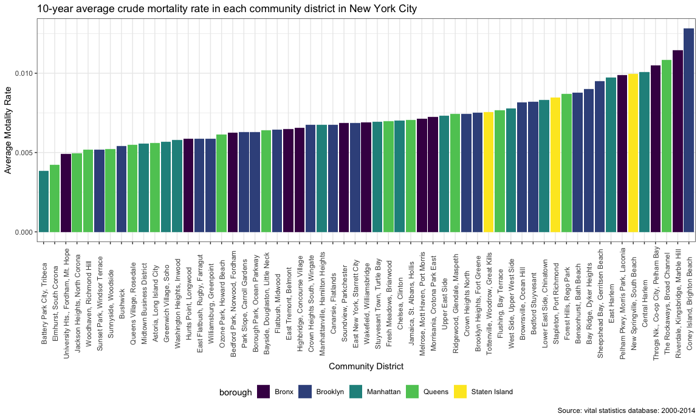

We can see that the mortality rate were higher on average in Bronx and Brooklyn. Besides, all the three community districts in Staten Island had high mortality rate, which could be due to a higher proportion of aged population. The boroughs with highest mortality were Coney Island in Brooklyn and Riverdale in Bronx. Average death rates were lowest in Battery park, followed by Elmuhurst in Quees. The areas with more wealthy people like Manhattan and Queens have a relative low mortality rate overall.

\*\* map of crude mortality rate in NYC \*\*

``` r
URL <- "http://services5.arcgis.com/GfwWNkhOj9bNBqoJ/arcgis/rest/services/nycd/FeatureServer/0/query?where=1=1&outFields=*&outSR=4326&f=geojson"
fil <- "nyc_community_districts.geojson"
if (!file.exists(fil)) download.file(URL, fil)

nyc_districts = geojson_read(fil, what="sp")


nyc_districts_map = fortify(nyc_districts, region="BoroCD") # add border line 

mids = cbind.data.frame(as.data.frame(gCentroid(nyc_districts, byid=TRUE)), 
                         id=nyc_districts$BoroCD)

ny_map = ggplot() %>% +  # draw NYC map
         geom_map(data=nyc_districts_map, map=nyc_districts_map,
                    aes(x=long, y=lat, map_id=id),
                    color="#2b2b2b", size=0.15, fill=NA) + 
        geom_text(data=mids, aes(x=x, y=y, label=id), size=2) +
        coord_map() + 
        ggthemes::theme_map()
```

    ## Warning: Ignoring unknown aesthetics: x, y

``` r
par(mfrow = c(2,1))
 nyc_districts@data =  merge(nyc_districts@data, cd_death_rate, by.x = "BoroCD", by.y = "cd_number")

choro = data.frame(district=nyc_districts@data$BoroCD,  
                    average_death_rate=nyc_districts@data$average_death_rate)

cd_death_map = nyc_districts_map %>% # add color to map 
ggplot()+
geom_map(map=nyc_districts_map,
                    aes(x=long, y=lat, map_id=id),
                    color="#2b2b2b", size=0.15, fill=NA) +
geom_map(data=choro, map=nyc_districts_map,
                    aes(fill=average_death_rate, map_id=district),
                    color="#2b2b2b", size=0.15) +
scale_fill_viridis(name="Average death rate") + 
coord_map() +
ggthemes::theme_map() +
theme(legend.position=c(0.1,0.5)) +
   labs(title = "average crude mortality rate in each community district in New York City from 2000 to 2014"
            )
```

    ## Warning: Ignoring unknown aesthetics: x, y

``` r
cd_death_map
```


Geographically speaking, the map shows a very interesting pattern that the far north and the far south part of New York had the highest mortality rates. The middle part of New York had a lower mortality rate. This is conincident with New York income level where people live in the middle part usually have a higher income while neighbourhood in Staten Island share a high proportion of aged people.

\*\* leading cause of death in 5 borough in NYC \*\*

``` r
# cause-specific mortality rate in each borough
specific_death_rate = total_death_data %>%
  group_by(borough, year, cause_of_death) %>%
  summarise(cause_specific_death = sum(number, na.rm = TRUE), population = sum(population)) %>% # calculate the population  in each borough and number of people died of each cause 
  mutate(cause_specific_death_rate = cause_specific_death/population) %>% # calculate cause-specific mortality rate
  group_by(borough, cause_of_death) %>% # get average death rate
  summarise(mean_cs_death_rate = mean(cause_specific_death_rate)) %>%
  arrange(borough, mean_cs_death_rate)

specific_death_rate %>%
  ggplot(aes(x = reorder(cause_of_death, mean_cs_death_rate), y = mean_cs_death_rate)) +
  geom_bar(aes(fill = cause_of_death), stat = "identity") +
  facet_grid(. ~ borough)  +
   labs(title = "14-year average cause-specific crude mortality rate in each borough",
             x = "Cause of Death",
             y = "Cause-specific Mortality Rate",
              caption = "Source: vital statistics database: 2000-2014") +
        theme(axis.text.x = element_text(angle=90, size = 8, vjust=0.6)) +
        theme(legend.position="bottom", 
              legend.key.size = unit(.1, "in")) +
    coord_flip()  +
  viridis::scale_fill_viridis(discrete = TRUE)
```

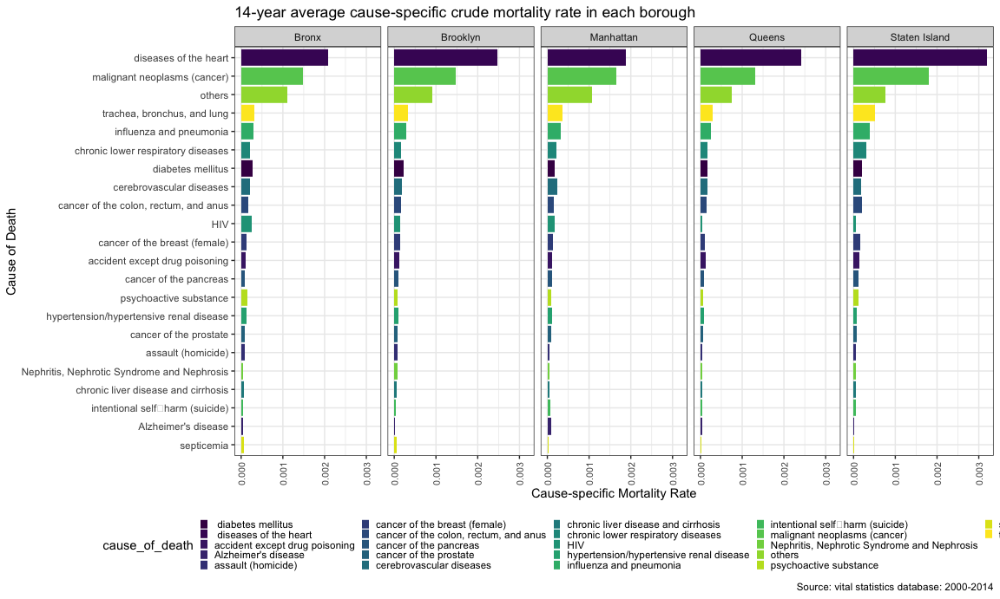

In this plot, caused of death was ordered by the cause specific mortality rate across New York City rather than each borough. We can see that the disease of the heart was the leading cause of deaths in all areas followed by malignant neoplasms as the second leading cause of mortality in each neighbourhood. Heart disease-related mortality rate was particularly high in Staten Island while death rate by HIV and diabetes mellites was high in Bronx. Queens, which holds a higher proportion of immigrants, was feature with high colon cancer risk. Overall, in terms of Cause of Deaths distribution across areas, we do not see a big difference in the structure of the cause of deaths.

\*\* trend of mortality rate in NYC from 2000 to 2010 \*\*

``` r
# annual mortality rate in New York City from 2000 to 2010
year_death_rate = total_death_data %>%
  group_by(borough, year) %>%
  summarise(total_borough_death = sum(number, na.rm = TRUE), population = sum(population)/22) %>%
  mutate(motality_rate = total_borough_death/population) 
  

year_death_rate %>%
  ggplot(aes(x = year, y = motality_rate, group = borough, color = borough)) +
  geom_line() + 
  geom_point() +
  labs(x = "Year", 
         y = "Crude motality rate", 
         title = "Crude motality rate in New York City across time") + 
  viridis::scale_color_viridis(discrete = TRUE)
```

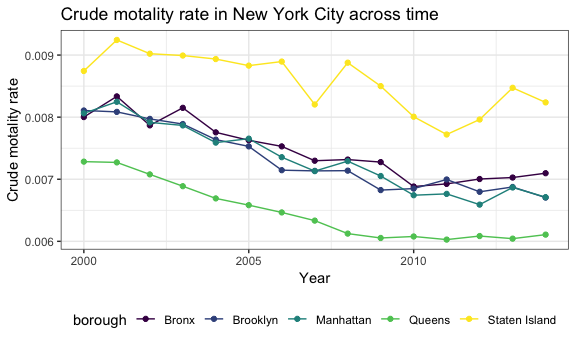

From a longitudinal perspective, the mortality rate went down as the years went by. The mortality rate for Brooklyn, Manhattan and Bronx were clustered together in terms of years. Staten Island had a higher mortality rate overall and Queens had the lowest mortality rate. There was a drop in mortality rates between 2006 and 2007. In 2010, there was a second drop in mortality rates.

\*\* leading cause of death in selected year \*\*

``` r
year_cs_death_ny = total_death_data %>%
  group_by(year, cause_of_death) %>%
  summarise(specific_death_number = sum(number, na.rm = TRUE), total_population = sum(population)) %>%
  mutate(motality_rate = specific_death_number/total_population) %>%
filter(year %in% c("2000", "2006", "2013", "2014")) %>%
  group_by(year) %>%
  top_n(n = 10, wt = motality_rate) 
  
lead_cause = merge(year_cs_death_ny, total_death_data) %>% 
  group_by(year, cause_of_death) %>%
  summarise(specific_death_number = sum(number, na.rm = TRUE), total_population = sum(population)) %>%
  mutate(motality_rate = specific_death_number/total_population)

# identify the top ten death by borough
lead_death3 = merge(lead_cause, total_death_data, by = c("year", "cause_of_death")) %>%
  group_by(borough, year, cause_of_death) %>%
  summarise(br_death_number = sum(number, na.rm = TRUE), br_population = sum(population)) %>%
  mutate(br_rate = br_death_number/br_population)
  
yr00 =   
lead_death3 %>% 

  filter(year == 2000) %>%
  ggplot(aes(reorder(x = cause_of_death, br_rate), y = br_rate, fill = borough)) +
  geom_bar(stat = "identity") + 
  theme_bw() +
   theme(axis.text.x = element_text(angle=90, vjust=0.6)) +
   labs(x = "Cause of death", 
         y = "Crude mortality rate", 
         title = "leading cause of death in 2000") +
  coord_flip()  +
  viridis::scale_fill_viridis(discrete = TRUE) 

yr06 = 
lead_death3 %>% 
filter(year == 2006) %>%
  ggplot(aes(reorder(x = cause_of_death, br_rate), y = br_rate, fill = borough)) +
  geom_bar(stat = "identity") + 
  theme_bw() +
   theme(axis.text.x = element_text(angle=90, vjust=0.6)) +
   labs(x = "Cause of death", 
         y = "Crude mortality rate", 
         title = "leading cause of death in 2006") +
  coord_flip()  +
  viridis::scale_fill_viridis(discrete = TRUE) 

yr12 = 
lead_death3 %>% 
filter(year == 2013) %>%
  ggplot(aes(reorder(x = cause_of_death, br_rate), y = br_rate, fill = borough)) +
  geom_bar(stat = "identity") + 
  theme_bw() +
   theme(axis.text.x = element_text(angle=90, vjust=0.6)) +
   labs(x = "Cause of death", 
         y = "Crude mortality rate", 
         title = "leading cause of death in 2013") +
  coord_flip()  +
  viridis::scale_fill_viridis(discrete = TRUE) 

yr14=
  lead_death3 %>% 
filter(year == 2014) %>%
  ggplot(aes(reorder(x = cause_of_death, br_rate), y = br_rate, fill = borough)) +
  geom_bar(stat = "identity") + 
  theme_bw() +
   theme(axis.text.x = element_text(angle=90, vjust=0.6)) +
   labs(x = "Cause of death", 
         y = "Crude mortality rate", 
         title = "leading cause of death in 2014") +
  coord_flip()  +
  viridis::scale_fill_viridis(discrete = TRUE) 


ggarrange(yr00, yr06, yr12, yr14, ncol=2, nrow=2, common.legend = TRUE, legend="bottom")
```

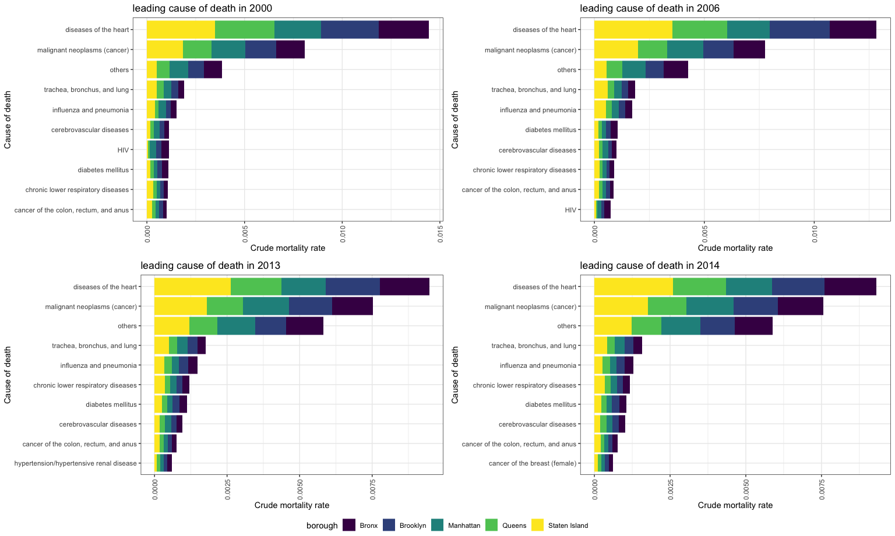

Heart disease and malignant neoplasms (cancer) were by far the most leading cause of death in our selected years. The leading cause of death basicly remained unchanged from 2013 to 2014 with a only a change in the 10th place where hypertension is replaced by cancer of breast. HIV dropped out from the top ten while breast cancer emerged as new major causes.

#### death data analysis by gender

**cause of death by gender**

``` r
# death by gender in each borough by year
# get the leading cause of each gender
gender_death_cause = gender_death_data2 %>%
  group_by(gender, cause_of_death) %>%
  summarise(average_death = sum(number_cs_boro_gdr)/15) %>%
  top_n(n = 10, wt = average_death) %>%
  arrange(gender, desc(average_death))

# filter out this cause from the dataset and calculate number of death
gender_death_cause2 = merge(gender_death_cause, gender_death_data2) %>%
   group_by(gender, cause_of_death, borough) %>%
  summarise(average_death = sum(number_cs_boro_gdr)/15) 
   
   

female1 = gender_death_cause2 %>% 
  filter(gender == "female") %>%
  ggplot(aes(x = reorder(cause_of_death, average_death), y = average_death, fill = borough)) +
  geom_bar(stat = "identity") +

  labs(x = "Cause of death", 
         y = "Number of death", 
         title = "leading cause of death for female") + 
theme_bw()+
   theme(axis.text.x = element_text(angle=90, vjust=0.6)) +
  
  viridis::scale_fill_viridis(discrete = TRUE) +
  coord_flip()

male1 = gender_death_cause2 %>% 
  filter(gender == "male") %>%
  ggplot(aes(x = reorder(cause_of_death, average_death), y = average_death, fill = borough)) +
  geom_bar(stat = "identity" ) +
  ylim(c(0, 10000)) +
  
theme_bw()+
   theme(axis.text.x = element_text(angle=90, vjust=0.6)) +
   labs(x = "Cause of death", 
         y = "Number of death", 
         title = "leading cause of death for male") +
  viridis::scale_fill_viridis(discrete = TRUE) +
  coord_flip()

ggarrange(male1, female1, ncol=2, nrow=1, common.legend = TRUE, legend="bottom")
```

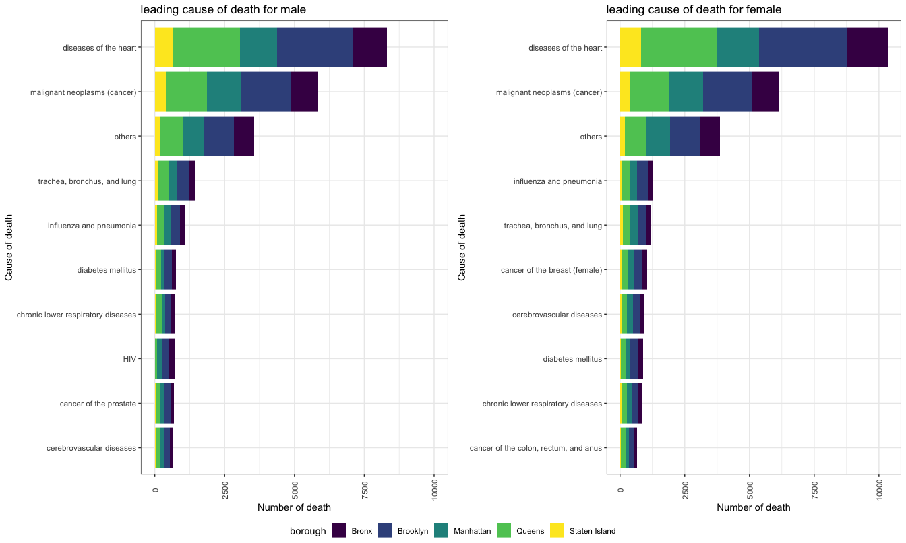

Although heart diseas and malignant neoplasms remained the most two major cause of death in two gender, male and female showed very different patern in cause of death. Breast cancer, obviously, was specific to women while prostate cancer was specific to men. We can see that breast cancer ranked the 6th leading cause of female death, however, the risk was diluted in the whole population. Lower respiratory disease was more of a risk than male compared to female, which could be expained by a larger proportion of smoking population in male. Beside, HIV was a greater issue for male and cancer of colon was unique in top ten causes for female.

**number of death by gender**

``` r
gender_death_data2 %>%
   group_by(year, gender) %>%
  summarise(total_death = sum(number_cs_boro_gdr)) %>%
  ggplot(aes(x = year, y = total_death, color = gender)) +
  geom_point() +
  geom_line() + 
   labs(title = "Number of death in different gender group in New York City",
             x = "Year",
             y = "Number of death")  + 
  theme_bw()+
  viridis::scale_color_viridis(discrete = TRUE) +
   theme(axis.text.x = element_text(angle=90, vjust=0.6))
```

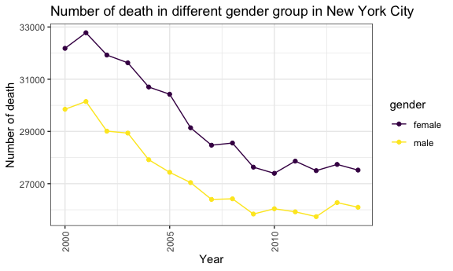

The number of deaths for female was overall greater than the number of deaths for male. The curves for the two groups were parallel to each other over time. We assume there is some difference between men and women in terms of the number of deaths but the difference was not due to the change of time. One possible explanation was age-population was disproportionately high in femal group since female usually has longer life expectancy.

#### data analysis by race

**cause of death by race**

``` r
race_death_data2 = race_death_data2 %>%
  ungroup() %>%
  mutate(race = case_when(
    race == 1 ~ "Hispanic",
    race == 3 ~ "Asian Non-Hispanic",
    race == 4 ~ "White Non-Hispanic",
    race == 5 ~ "Black Non-hispanic"
  )) 

# identify the top leading cause in NYC


race_death_cause  = race_death_data2%>%
  group_by(race, cause_of_death) %>%
  summarise(cs_death_race = sum(borough_race_death)/11)  %>% # average yearly death from 2004 to
  top_n(n = 10, wt = cs_death_race) %>%
  arrange(race, desc(cs_death_race)) 
```

``` r
#filter only data with our interested cause of death
race_death_cd = merge(race_death_data2, race_death_cause) %>%
  group_by(race, cause_of_death, borough) %>%
  summarise(race_ds_br = sum(borough_race_death)/10) 

hispanic = race_death_cd %>% 
  filter(race == "Hispanic") %>%
  ggplot(aes(x = reorder(cause_of_death, race_ds_br), y = race_ds_br, fill = borough)) +
  geom_bar(stat = "identity") +

  labs(x = "Cause of death", 
         y = "Number of death", 
         title = "leading cause of death for Hispanic") + 
theme_bw() +
   theme(axis.text.x = element_text(angle=90, vjust=0.6, face = "bold")) +
  viridis::scale_fill_viridis(discrete = TRUE)  +
  coord_flip()
```

``` r
asian = race_death_cd %>% 
  filter(race == "Asian Non-Hispanic") %>%
  ggplot(aes(x = reorder(cause_of_death, race_ds_br), y = race_ds_br, fill = borough)) +
  geom_bar(stat = "identity") +

  labs(x = "Cause of death", 
         y = "Number of death", 
         title = "leading cause of death for Asian") +
  theme_bw()+
   theme(axis.text.x = element_text(angle=90, vjust=0.6, face = "bold")) +
  viridis::scale_fill_viridis(discrete = TRUE) +
  coord_flip()
```

``` r
white = race_death_cd %>% 
  filter(race == "White Non-Hispanic") %>%
  ggplot(aes(x = reorder(cause_of_death, race_ds_br), y = race_ds_br, fill = borough)) +
  geom_bar(stat = "identity") +

  labs(x = "Cause of death", 
         y = "Number of death", 
         title = "leading cause of death for White") + 
theme_bw()+
   theme(axis.text.x = element_text(angle=90, vjust=0.6, face = "bold")) +
  viridis::scale_fill_viridis(discrete = TRUE)  +
  coord_flip()
```

``` r
black = 
race_death_cd %>% 
  filter(race == "Black Non-hispanic") %>%
  ggplot(aes(x = reorder(cause_of_death, race_ds_br), y = race_ds_br, fill = borough)) +
  geom_bar(stat = "identity") +

  labs(x = "Cause of death", 
         y = "Number of death", 
         title = "leading cause of death for Black") + 
theme_bw() +
   theme(axis.text.x = element_text(angle=90, vjust=0.6, face = "bold")) +
  viridis::scale_fill_viridis(discrete = TRUE) +
  coord_flip()

ggarrange(hispanic, asian, white, black, ncol=2, nrow=2, common.legend = TRUE, legend="bottom")
```

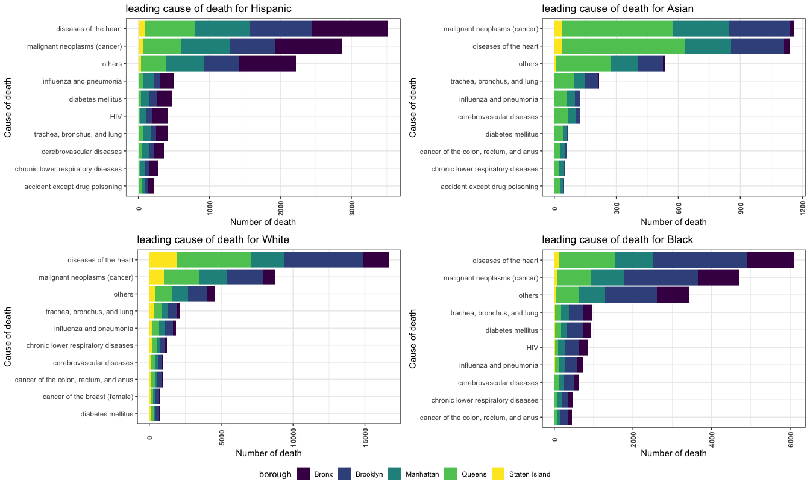

Different race has similar cause of death pattern with heart disease and malignant neoplasms ranked as the leading two causes of death. HIV only appeared in the Hispanic and the Black group while breast cancer is a leading cause in the White only. Accident except poisoning was ranked as 10th fro Asians and Hispanics but not in the leading cause list for the other two group.

\*\* death number by race\*\*

``` r
race_death_data2 %>%
  group_by(race, year) %>%
  summarise(total_death_yr_rc = sum(borough_race_death)) %>%
  ggplot(aes(x = year, y = total_death_yr_rc, color = race)) +
  geom_line() +
  geom_point() +
  theme_bw() +
    viridis::scale_fill_viridis(discrete = TRUE) +
  labs(x = "Year", 
         y = "Number of death", 
         title = "Change in total number of death in each race group") + 
  viridis::scale_fill_viridis(discrete = TRUE)  
```

    ## Scale for 'fill' is already present. Adding another scale for 'fill',
    ## which will replace the existing scale.

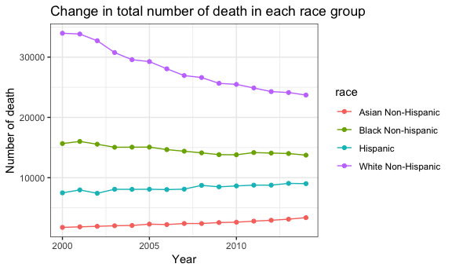

The plotted 15 years witnessed a dramatic drop in tems of death number in the White while this statistics kept stable in the Black and Hispanic. A slight rise can be observed in the Asia group, however, this could be confounded by a rapid increase in Asian population. Since a drop in the White death number was conincident with a dropped in HIV related death, and meanwhile HIV remained one of those leading caused in the Hispanic and Black, we assumed that the decrease in the White death was partly due to decrease in HIV-caused death.

#### death data analysis by age group

**cause of death by age**

``` r
# leading cause of death in each age group
age_death_cause = age_death_data3 %>%
  group_by(age_group, cause_of_death) %>%
  summarise(av_death_age = sum(borough_age_death)/11 ) %>%
  top_n(n = 10, wt = av_death_age) %>%
  arrange(age_group, desc(av_death_age)) 

# not much useful info in the newborn and under 1 group 
age_death_cause = age_death_cause %>%
  filter(age_group == "Premature Death" | age_group == ">65 age death")
```

``` r
age_death_data3 = merge(age_death_data3, age_death_cause) %>%
  group_by(cause_of_death, age_group, borough) %>%
  summarise(br_death_age = sum(av_death_age)/11) 

over_65_2 = age_death_data3 %>%
  filter(age_group == ">65 age death") %>%
  ggplot(aes(x = reorder(cause_of_death, br_death_age), y = br_death_age, fill = borough)) +
  geom_bar(stat = "identity") + 
  labs(x = "Cause of death", 
         y = "Number of death", 
         title = "leading cause of death for over 65 year old group ") + 
theme_bw() +
   theme(axis.text.x = element_text(angle=90, vjust=0.6)) +
  viridis::scale_fill_viridis(discrete = TRUE)  +
  coord_flip()


premature2 = age_death_data3 %>%
  filter(age_group == "Premature Death") %>%
  ggplot(aes(x = reorder(cause_of_death, br_death_age), y = br_death_age, fill = borough)) +
  geom_bar(stat = "identity") + 
  labs(x = "Cause of death", 
         y = "Number of death", 
         title = "leading cause of death for premature death") + 
theme_bw()+
   theme(axis.text.x = element_text(angle=90, vjust=0.6)) +
  viridis::scale_fill_viridis(discrete = TRUE) +
  coord_flip()


ggarrange(over_65_2, premature2, ncol=2, nrow=1, common.legend = TRUE, legend="bottom")
```


The cause of deaths in the more-than-65-year-old group was very different from that in the premature deaths group. Chronic diseas such as heart disease and hypertension a greater risk in aged people while higher proportion of premature death was due to homicide, psychoactive substance and HIV.

6. conclusion and future work
-----------------------------

In terms of cause of death, heart disease and malignant neoplasms were by far the top causes of death regardless of bourough of residency, gender, age and race. Difference among gender groups and year are small. One major change over time is that HIV has dropped out from the top ten leading cause of death. However, it kept remained in the top risk list for the Black and Hispanic. Difference among gender and age group, on the other hand, was relatively large. Chronic disease was the main risk for aged-people while HIV and homicide were only in the top cause of premature death.

We were intended to merge the birth dataset with the death dataset and explore the relationship between maternal/neonatal death rate and maternal characteristics. However, maternal and neonatal death dataset required permission and therefore split into two relatively individual parts. In the birth data analysis, we observed an sure rising trend in advanced maternal age. This could impact on the maternal and infant mortality as well as infant defect (one of our future work). Other variables, such as maternal nativity, maternal status also varied across different borough.

Other future work include stratifying each community districts in New York into according to porverty level and examining its associate with death and birth rate.
